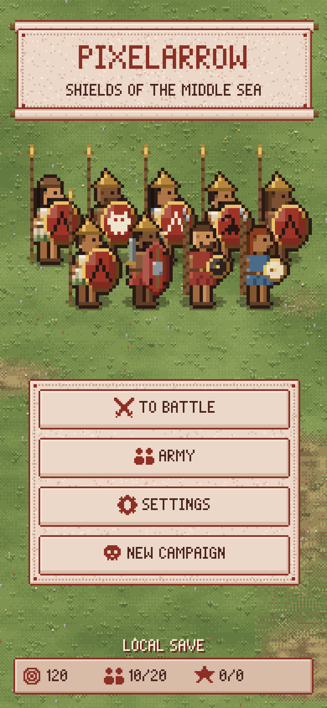
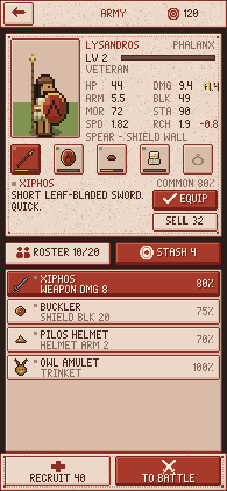
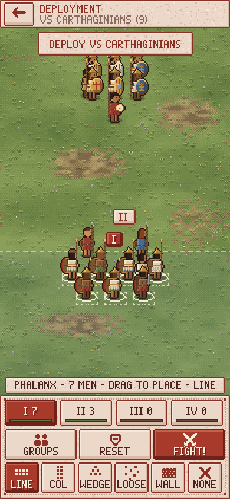
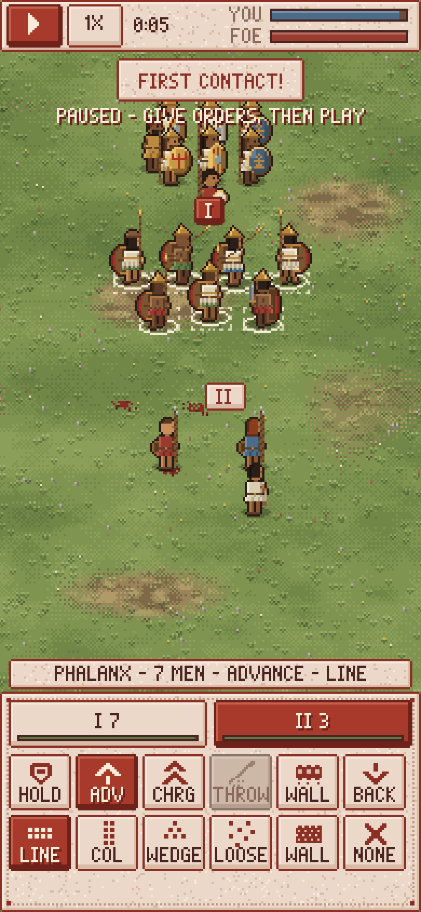
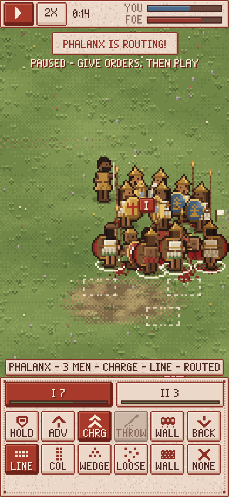
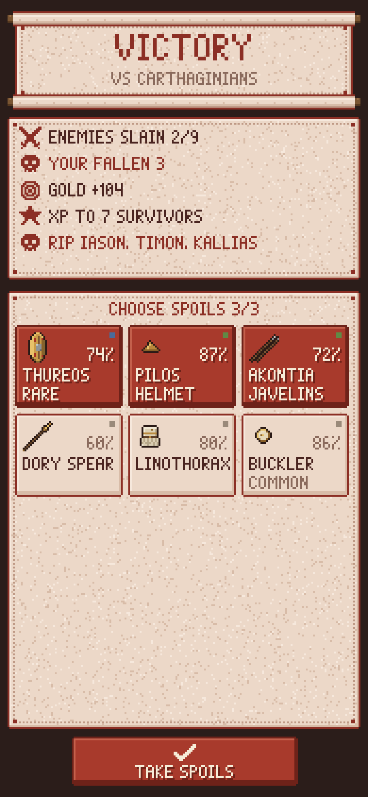

# Pixelarrow

A mobile-first pixel-art formation tactics game set in the ancient
Mediterranean — locked shields, thrown javelins, flanks wheeling to meet
threats and lines that break when morale breaks. Built with Phaser 3,
TypeScript and Vite, and designed to run as a **Telegram Mini App**
(it also runs in any browser).

All art (soldiers, shields and emblems, grass, UI, font, icons) is generated
procedurally in code at startup.

| | | |
| --- | --- | --- |
|  |  |  |
|  |  |  |

Game design and mechanics: [docs/DESIGN.md](docs/DESIGN.md).

## Run, build, test

Requires Node 20+.

```bash
npm install
npm run dev        # dev server on http://localhost:5173 (also on your LAN)
npm run build      # type-check + production build into dist/
npm run preview    # serve dist/ on http://localhost:4173
npm test           # vitest: simulation determinism, combat rules, loot, saves
npx tsc --noEmit   # type-check only
```

Open the dev server on a phone (same Wi-Fi) or use the browser's device
toolbar in portrait mode. `http://localhost:5173/preview.html` shows the
procedural sprite sheets.

### Screenshots and smoke test

With a dev or preview server running and Playwright's Chromium available
(set `PLAYWRIGHT_BROWSERS_PATH` if your browsers live outside the default cache):

```bash
node scripts/screenshots.mjs http://localhost:5173/ docs/screenshots   # tour of every screen
node scripts/smoke.mjs http://localhost:5173/                         # real touch input: taps, drag, pinch
```

## Project layout

```
src/
  sim/        pure TS battle simulation (no Phaser): battle.ts, ai.ts, formation.ts, stats.ts, rng.ts, types.ts
  data/       items.ts (all gear), traits.ts, units.ts (hero model, base stats), names.ts
  game/       campaign.ts, heroes.ts (factories), enemy.ts (bot army), loot.ts, save.ts, armySpec.ts
  art/        procedural pixel art: paperdoll.ts, emblems.ts, ground.ts, font.ts, icons.ts, itemIcons.ts, uiTextures.ts
  ui/         Phaser UI kit (buttons, panels, meters, scroll lists) and texture registration
  scenes/     Boot, Menu, Army, Battle (deployment + battle), Results
  platform/   telegram.ts (WebApp SDK wrapper), storage.ts (CloudStorage / localStorage)
  state.ts    shared campaign state and persistence
tests/        vitest suites
scripts/      screenshot tour and touch smoke test (Playwright)
docs/         DESIGN.md and screenshots
```

## Telegram Mini App setup

1. **Deploy the build** somewhere with HTTPS: run `npm run build` and upload
   `dist/` to any static host (GitHub Pages, Netlify, Cloudflare Pages, Vercel,
   an S3 bucket...). The build uses relative paths, so a sub-folder works.
   For local testing you can expose the dev server with a tunnel
   (e.g. `cloudflared tunnel --url http://localhost:5173` or `ngrok http 5173`).
2. **Create a bot** with [@BotFather](https://t.me/BotFather): `/newbot`,
   choose a name and username, keep the token.
3. **Create the Mini App:** in BotFather send `/newapp`, pick your bot, give a
   title, description and a 640×360 image, then enter your HTTPS URL. BotFather
   returns a direct link like `https://t.me/<bot>/<app>`.
4. Optionally set the bot's **menu button** to open the game:
   `/mybots` → your bot → *Bot Settings* → *Menu Button* → set the same URL.
5. Open the link in Telegram (mobile recommended).

What the game does inside Telegram (all optional, no-ops in a browser):

- Loads `telegram-web-app.js` only when launched from Telegram, then calls
  `ready()`, `expand()`, `disableVerticalSwipes()` (so drags don't close the
  app) and sets the header/background colour.
- Saves to **Telegram CloudStorage** (synced across the user's devices,
  chunked under the 4 KB value limit) and mirrors to localStorage.
- **Haptics** on orders, hits, deaths and routs (toggle in Settings).
- The native **BackButton** navigates back (Army → Menu, Results → Army) and
  pauses/resumes during battle.

## Status

First playable milestone: offline 1v1 against the bot. No sailing or camp yet.
See "Known gaps" in [docs/DESIGN.md](docs/DESIGN.md) for what comes next.
