# Pixelarrow

A mobile-first pixel-art formation tactics game set in the ancient
Mediterranean — locked shields, thrown javelins, flanks wheeling to meet
threats and lines that break when morale breaks. Lead a band of three heroes
across a procedurally generated coast in the manner of Mount & Blade: march
between towns and villages, hire men, buy gear, dodge or hunt bandits and
raiders, and raise your heroes through attributes, perk trees, battle
abilities and auras. Built with Phaser 3,
TypeScript and Vite, and designed to run as a **Telegram Mini App**
(it also runs in any browser).

**Play:** https://pixelarrow.app (sprite sheets:
https://pixelarrow.app/preview.html)

All art (soldiers, shields and emblems, grass, the world map, towns, UI,
font, icons, effects) is generated procedurally in code at startup.

| | | |
| --- | --- | --- |
| 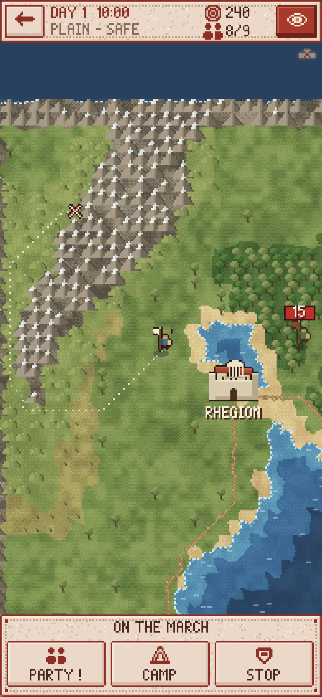 | 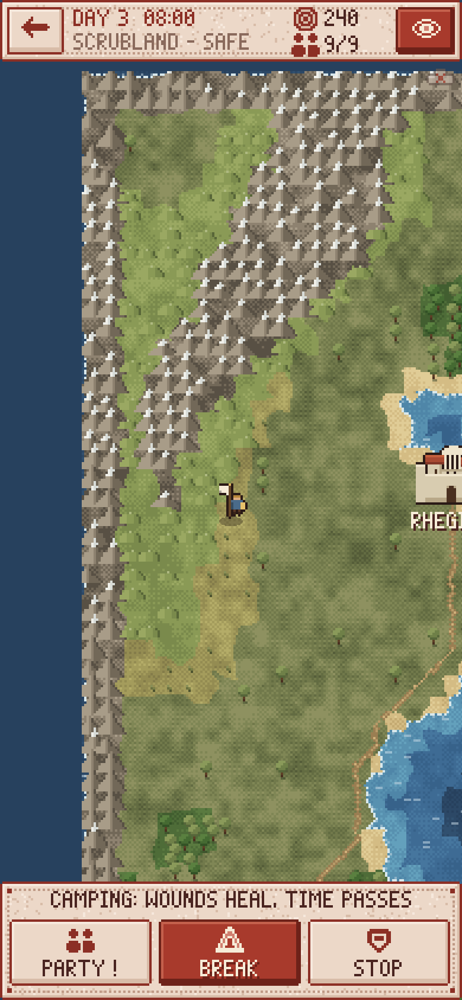 | 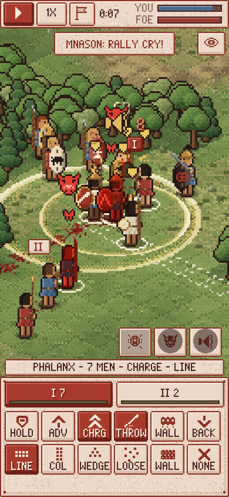 |
| 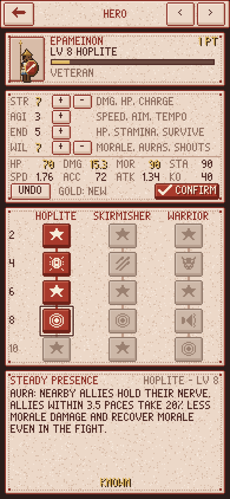 | 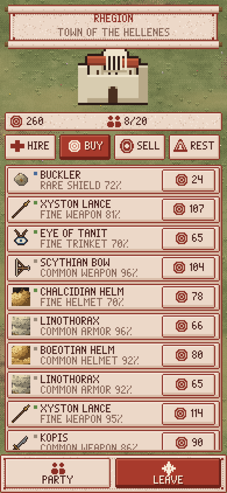 | 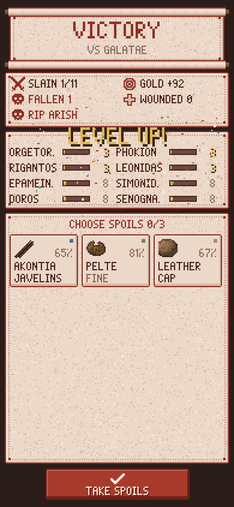 |
|  |  | 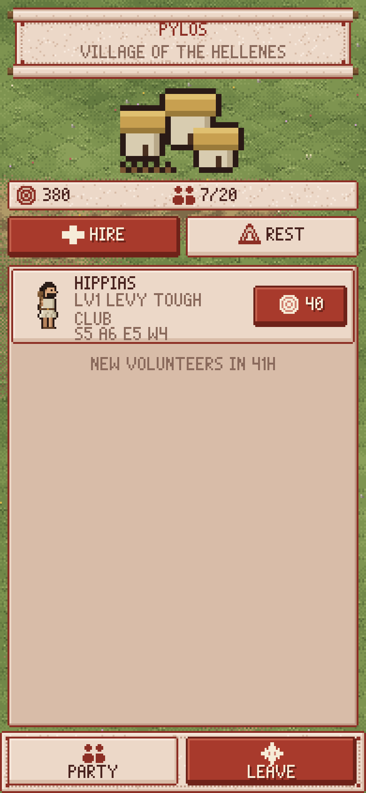 |
|  |  | 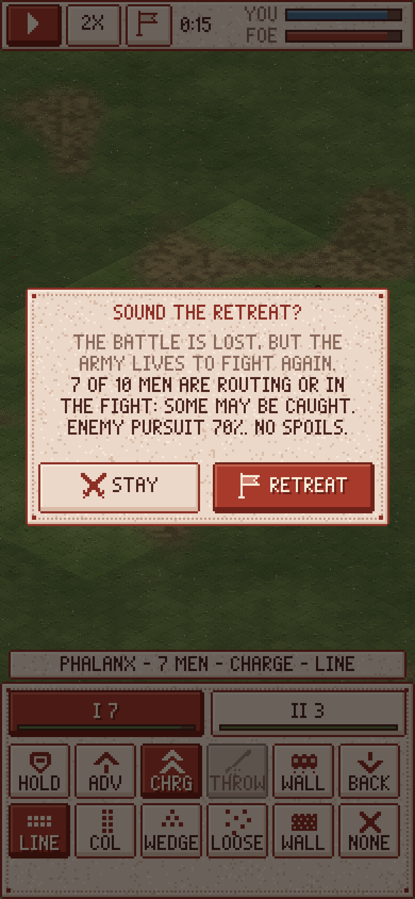 |

| 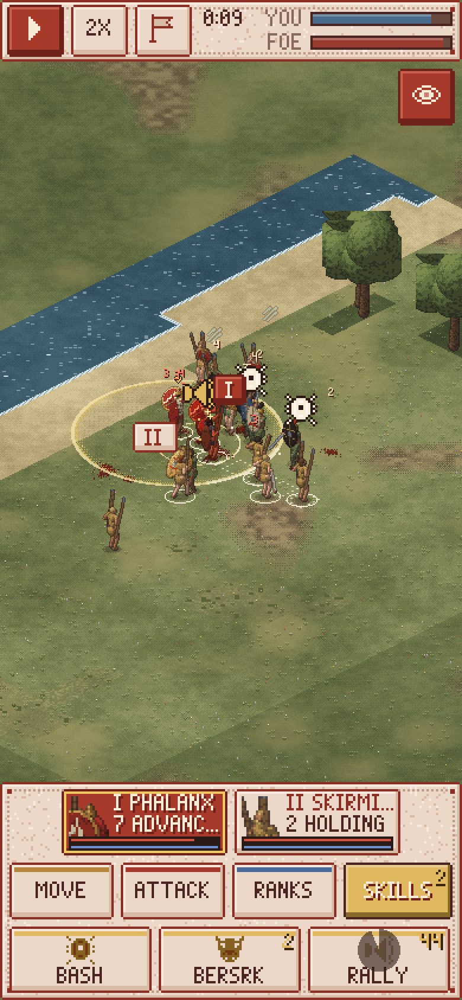 | 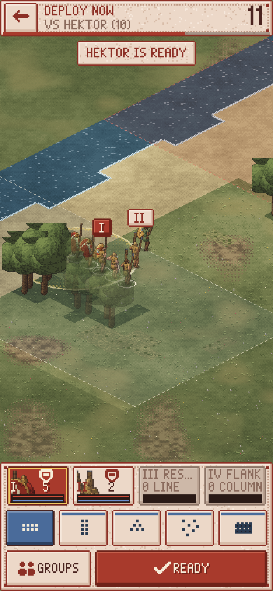 | 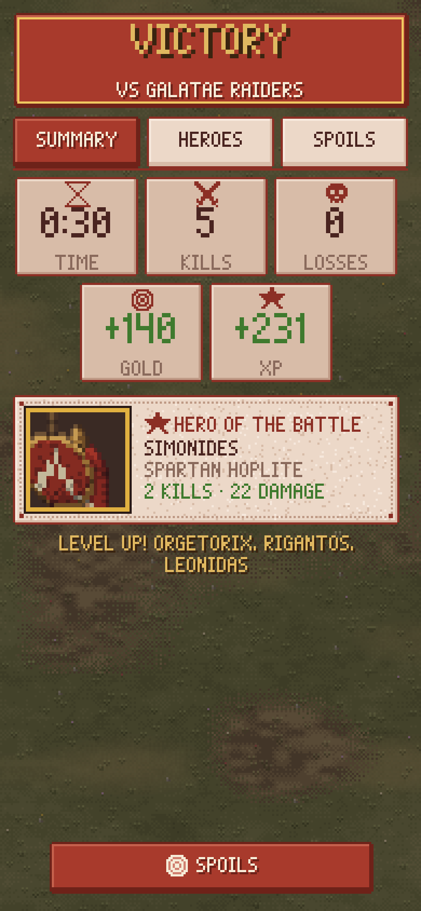 |

The battle command panel groups orders by colour (Movement bronze, Attack red,
Formation blue, Abilities gold, with cooldown sweeps); group cards show the
class portrait, men, health, morale and the current order; long-press any
button for an explanation, and a greyed-out button says why on tap. On small
phones the panel folds into two rows. Online battles (attacks and duels) have
no pause and no speed-up and open with a 15-second deployment: a countdown,
the enemy's zone but not its men, and Ready (a duel starts when both are ready
or the time is up). Every battle ends with the same report: a VICTORY or
DEFEAT banner, count-up tiles, the hero of the battle, XP bars per hero and
loot cards that turn over one by one (tap to inspect and compare, then pick).

Game design and mechanics: [docs/DESIGN.md](docs/DESIGN.md). Where it is
going (online multiplayer, clans, Telegram Stars) and the invariants the code
keeps for that: [docs/ROADMAP.md](docs/ROADMAP.md).

## Run, build, test

Requires Node 22+ (vitest 5 needs 22.12+).

```bash
npm install
npm run dev        # dev server on http://localhost:5173 (also on your LAN)
npm run build      # type-check + production build into dist/
npm run preview    # serve dist/ on http://localhost:4173
npm test           # vitest: determinism, combat rules, abilities/auras/cooldowns, world map, campaign, saves
npm run balance    # headless: 200 seeded bot-vs-bot battles, rule scenarios, ability/aura mirror tests
npx tsc --noEmit   # type-check only
```

Open the dev server on a phone (same Wi-Fi) or use the browser's device
toolbar in portrait mode. `http://localhost:5173/preview.html` shows the
procedural sprite sheets (it is also part of the production build).

### Deployment (Cloudflare)

`.github/workflows/deploy.yml` runs on every push to `main` (and manually via
*Run workflow*): `npm ci`, type-check, tests, `npm run build`, then
`wrangler deploy` publishes `dist/` as static assets of a Cloudflare Worker
(`wrangler.jsonc`) on the custom domain https://pixelarrow.app. It needs the
repository secrets `CLOUDFLARE_API_TOKEN` and `CLOUDFLARE_ACCOUNT_ID`. The
build uses a relative `base` (`./`), so it also works under a sub-path and
inside Telegram.

### Screenshots and smoke test

With a dev or preview server running and Playwright's Chromium available
(set `PLAYWRIGHT_BROWSERS_PATH` if your browsers live outside the default cache):

```bash
node scripts/screenshots.mjs http://localhost:5173/ docs/screenshots   # tour of every screen
node scripts/smoke.mjs http://localhost:5173/                         # real taps through the campaign loop
node scripts/layout-check.mjs http://localhost:4173/                  # layout rules on every screen, 5 sizes, EN/RU
```

`scripts/layout-check.mjs` is also a CI gate before every deploy: it fails on
overlapping or too-small touch targets, overflowing text and anything outside
the safe area, except the known violations in `scripts/layout-allowlist.json`.
How screens are built (UI kit components, colours, touch rules, i18n) and how
the check works: [docs/UI_KIT.md](docs/UI_KIT.md).

`node scripts/fullscreen-smoke.mjs http://localhost:4173/` fakes a full-screen
Telegram on an iPhone and checks safe areas and Back navigation (see the
Telegram section).

`node scripts/online-smoke.mjs http://localhost:4173/` fakes Telegram and the
API (no backend needed): checks the game stays playable with the API down
(503 / unreachable), walks the Stars purchase flow and saves
`docs/screenshots/20-shop.png`.

### Online mode end to end

`node scripts/online-e2e.mjs http://localhost:5173/` (with `wrangler dev` and
`VITE_DEV_AUTH=1 npm run dev` running as below) drives two fake players
(`?devuser=<n>` picks the DEV_AUTH test user) through joining the season, a
server-verified attack, a clan formed through an invite link and a live
lockstep duel, and saves `docs/screenshots/23-online-map.png`, `24-clan.png`
and `25-duel.png`.

### Online features (cloud save, shop) locally

The client talks to the Worker in `server/` on the same origin (`/api/*`,
`/ws/*`); everything online is optional and the game is fully playable
without it (offline, plain browser, or while the API answers 503). To run
both locally:

```bash
npm run build                          # wrangler serves dist/ too
cd server && npm ci && cp .dev.vars.example ../.dev.vars && npm run migrate:local
npm run dev                            # wrangler dev on http://localhost:8787 (game + API)
cd .. && VITE_DEV_AUTH=1 npm run dev   # vite on :5173, proxies /api and /ws to :8787
```

`VITE_DEV_AUTH=1` (dev server only) signs a plain browser in as the
`DEV_AUTH` test user so cloud sync and battle verification can be tried
without Telegram; Stars purchases need Telegram. `API_PROXY=http://host:port`
changes the proxy target, `VITE_API_BASE` the API base at build time. See
[docs/DESIGN.md](docs/DESIGN.md#online-client-srcplatform) for how sync works.

`node scripts/store-images.mjs` (starts its own Vite server) renders the
Telegram store art in `docs/store/` (640x360 BotFather cover, 640x640 bot
avatar) from the game's own generators via `store.html` / `src/dev/store.ts`.

## Audio

All sound is synthesised at run time with the Web Audio API (`src/audio/`,
no audio files, no dependencies): gritty procedural effects (sword, spear and
axe clashes, shield blocks, arrows, javelins, sling stones, charge rumble and
hooves, war horns, battle cries, routs, noise-based grunts, ability stingers,
level-up, coins, UI clicks) and looping modal music (Karplus-Strong lyre,
frame drums, drone, aulos) for the map/menus, deployment and battle (layers
come in as the fighting heats up), with victory/defeat stingers.

- `engine.ts`: lazy AudioContext created on the first tap (iOS / Telegram
  requirement), master limiter + SFX and music buses, suspended while the page
  or Telegram is in the background or sound is off. Without Web Audio every
  call is a no-op.
- `voices.ts`: voice limiter (12 voices, 3 per sound, same-tick dedupe,
  priority stealing) so a big melee neither clips nor burns a phone's CPU;
  sounds are panned by screen x and attenuated by distance and camera zoom.
- `hooks.ts`: **the one file mapping game events to sounds** (battle sim
  events, scene music, UI). Scenes only call one-liners from it.
- Settings: Sound on/off, Music and Effects volume (0-10), saved with the
  other settings. A phone's hardware silent switch can't be detected from a web
  page (Web Audio plays through it on iOS), so players use the in-game toggle.

`/audio.html` plays every effect and track. `node scripts/audio-samples.mjs`
renders sample WAVs offline into [docs/audio-samples/](docs/audio-samples/)
(clash, shield block, javelin, war horn, level-up and 20 s of battle music);
`node scripts/audio-smoke.mjs <url>` checks the game with and without Web
Audio (unlock, mute, background, battle sounds under the voice cap, no console errors).

## Project layout

```
src/
  sim/        pure TS battle simulation (no Phaser): battle.ts, ai.ts, formation.ts, stats.ts, rng.ts, types.ts
  world/      pure TS overland campaign: map.ts (seeded map generator), path.ts (A*), world.ts (travel, bands, settlements), noise.ts
  data/       classes.ts (unit classes, mounts, beasts), items.ts (all gear), terrain.ts, traits.ts, perks.ts (attributes, perk trees, abilities, auras), units.ts (hero model), names.ts
  game/       campaign.ts, heroes.ts (factories, development), enemy.ts (bot and band armies), loot.ts, save.ts, armySpec.ts
  art/        procedural pixel art: model3d.ts (3D-primitive pixel renderer), materials.ts (colour ramps), paperdoll.ts (men, riders, chariots, animals), emblems.ts, ground.ts (iso tiles), iso.ts (projection), worldArt.ts (map, towns, bands), fx.ts (aura rings, stars, pips), font.ts, icons.ts, itemIcons.ts, uiTextures.ts
  audio/      procedural Web Audio: engine.ts (mixer, unlock, suspend), voices.ts (voice limiter), sfx.ts (effect recipes), music.ts (sequencer + tracks), synth.ts, hooks.ts (event -> sound mapping)
  ui/         Phaser UI kit (buttons, panels, meters, scroll lists), battleFx.ts (pooled battle effects), texture registration
  scenes/     Boot, Menu, World (map + encounters), Settlement, Army, Hero (skills), Battle (deployment + battle), Results
  platform/   telegram.ts (WebApp SDK wrapper), nav.ts (back navigation stack), safeArea.ts (full-screen insets), storage.ts (CloudStorage / localStorage), api.ts (typed API client),
              online.ts + saveSync.ts (sign-in, cloud save sync, shop, entitlements), cloud.ts (instance), verify.ts (battle replay check)
  dev/        preview.ts (sprite sheet page), balance.ts + classBalance.ts (headless balance harness for `npm run balance`)
  state.ts    shared campaign state and persistence
tests/        vitest suites
scripts/      screenshot tour and touch smoke test (Playwright), balance runner
docs/         DESIGN.md, ROADMAP.md and screenshots
```

## Telegram Mini App setup

1. **Deploy the build.** The Cloudflare workflow above publishes it to
   **https://pixelarrow.app** — that is the URL to give BotFather.
   (Any other HTTPS static host works too: upload `dist/`; the build uses
   relative paths, so a sub-folder is fine. For local testing expose the dev
   server with a tunnel, e.g. `cloudflared tunnel --url http://localhost:5173`.)
2. **Create a bot** with [@BotFather](https://t.me/BotFather): `/newbot`,
   choose a name and username, keep the token.
3. **Create the Mini App:** in BotFather send `/newapp`, pick your bot, give a
   title, description and a 640×360 image, then enter the URL
   `https://pixelarrow.app`. BotFather
   returns a direct link like `https://t.me/<bot>/<app>`.
4. Optionally set the bot's **menu button** to open the game:
   `/mybots` → your bot → *Bot Settings* → *Menu Button* →
   `https://pixelarrow.app`.
5. Open the link in Telegram (mobile recommended).

What the game does inside Telegram (all optional, no-ops in a browser):

- Loads `telegram-web-app.js` only when launched from Telegram, then calls
  `ready()`, `expand()`, `disableVerticalSwipes()` (so drags don't close the
  app) and sets the header/background colour.
- **Full screen** on phones with Bot API 8.0+ (`requestFullscreen()`, plus
  `lockOrientation()` in portrait). Older clients, desktop and a refused
  request (`fullscreenFailed`) keep the expanded view.
- **Safe areas:** the `#game` element is inset by the device safe area
  (`safeAreaInset`, or `env(safe-area-inset-*)` if larger) plus Telegram's
  content safe area (`contentSafeAreaInset`: the floating Close/Back and ⋯
  pills), see `src/platform/safeArea.ts` and `index.html`. Phaser's RESIZE
  mode sizes the canvas to that rect, so every scene's top and bottom bars stay
  clear of the notch, Telegram's buttons and the home indicator without
  per-scene code; `safeAreaChanged`, `contentSafeAreaChanged`,
  `viewportChanged` and `fullscreenChanged` re-layout. Outside Telegram the
  Telegram insets are 0.
- Saves to **Telegram CloudStorage** (synced across the user's devices,
  chunked under the 4 KB value limit) and mirrors to localStorage.
- **Haptics** on orders, hits, deaths and routs (toggle in Settings).
- **Native back navigation** (`src/platform/nav.ts`): Telegram's header Back
  button is the game's back button; the in-game back arrows are hidden inside
  Telegram. The menu is the root (Back hidden, Telegram shows Close). Back
  closes the top dialog first, then goes back one level (Hero → Army → map or
  town, town → map, map → menu, deployment → asks, then back to where the
  battle came from). In battle Back pauses and opens the Retreat confirm; it
  never leaves silently, and a band barring the road can't be dodged with it.
  The ⋯ menu's **Settings** opens the settings modal on any screen.
  **Closing confirmation** is on during battles and while a save uploads.

### Back navigation in new scenes

Every screen registers itself once in `create()`; nothing else is needed:

```ts
// a BaseScene subclass
this.screen({ back: () => this.scene.start('Menu') }); // back one level
this.screen({ back: null });                           // root screen (Telegram shows Close)
this.screen({ back, confirmClose: true });             // ask before Telegram closes the app
// any Phaser scene: registerScreen(scene, { back }) from src/platform/nav.ts

// each modal / dialog: Back closes it first (the layer goes away with the container)
this.modalLayer(container, () => container.destroy());
// return false from the close callback to keep a dialog that Back must not dismiss

// draw your own back arrow only outside Telegram
if (this.inGameBack) this.ui.add(new Button(this, 3, 2, 26, 20, { icon: 'back', onClick: back }));
```

The registration is removed when the scene shuts down; a scene launched on
top of another stacks above it. Exactly one BackButton handler is registered
with Telegram at a time. `node scripts/fullscreen-smoke.mjs <url>` checks all
of this with a fake full-screen iPhone Telegram (status bar 59, Telegram pills
46, home indicator 34) and saves `docs/screenshots/29-fullscreen-safe-area.png`.

## Status

Milestone 2: an offline single-player campaign on a procedural overland map
(towns, villages, lairs, roaming bands, wounds), hero progression (attributes,
perk trees, battle abilities, auras) and the real-time formation battles of
milestone 1. See "Known gaps" in [docs/DESIGN.md](docs/DESIGN.md) and the
online plan in [docs/ROADMAP.md](docs/ROADMAP.md).
