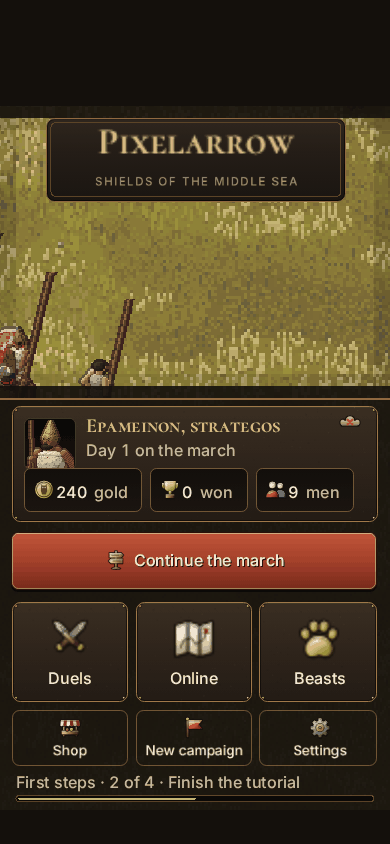
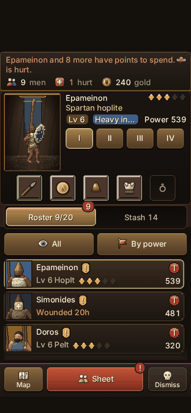
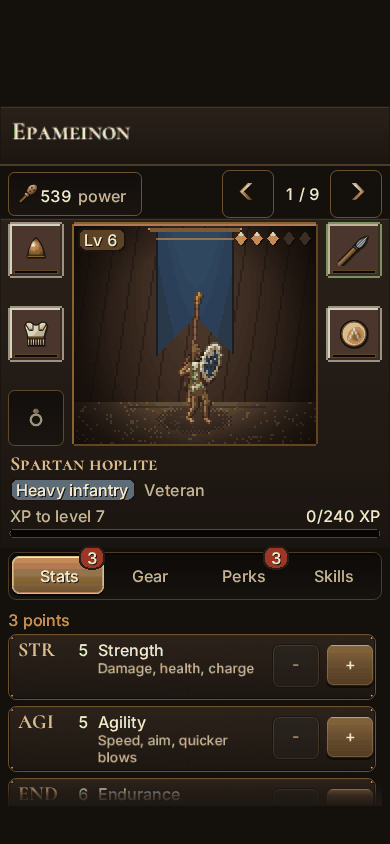
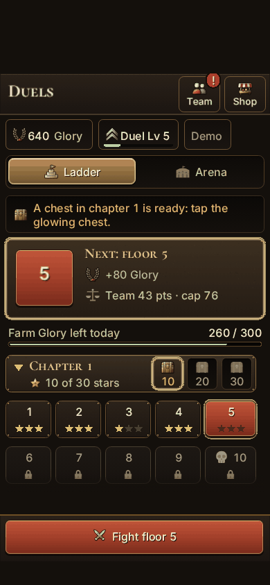
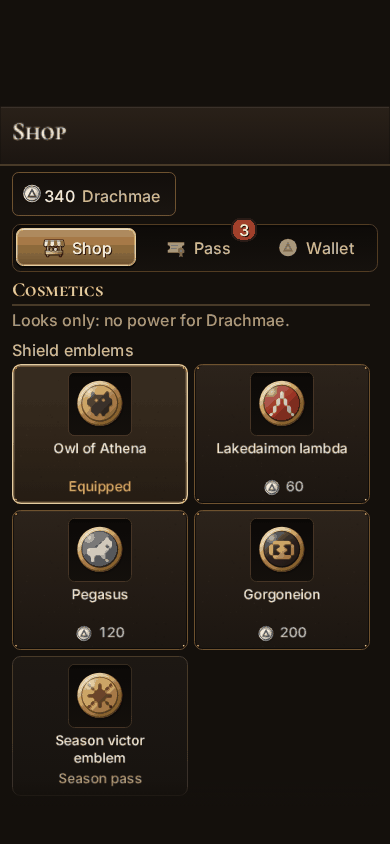
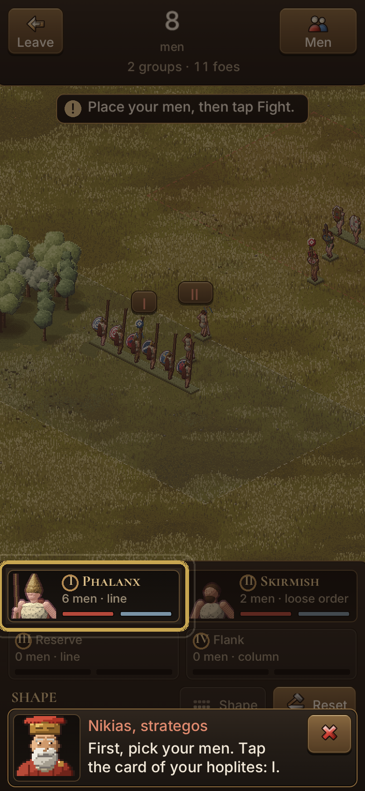

# Pixelarrow

A mobile-first pixel-art formation tactics game set in the ancient
Mediterranean: locked shields, thrown javelins, flanks wheeling to meet
threats and lines that break when morale breaks. Lead a band of heroes across
a procedurally generated coast, fight a seasonal online war for a shared map
with your clan, or take a persistent duel army up the ranked ladders. Built
with Phaser 3, TypeScript and Vite as a **Telegram Mini App** (it also runs in
any browser). The icons are drawn art, shipped as two atlases in `public/icons`.
All other art and all sound are generated in code; there are no other image or
audio files.

**Play:** https://pixelarrow.app

| | | |
| --- | --- | --- |
|  |  |  |
|  |  |  |

## Docs

- [docs/GAMEPLAY.md](docs/GAMEPLAY.md): the single-player game and the
  battle sim reference: campaign, heroes, classes, combat rules, terrain, bot
  AI, balance, controls, saves.
- [docs/DESIGN_V2.md](docs/DESIGN_V2.md): the seasonal online war: the
  region map, camps, beasts, clans, trading, economy, online battle rules, UX
  requirements.
- [docs/DUELS.md](docs/DUELS.md): duels: the duel army, ladder, ranked live
  and async, seasons, the duel shop and the war-map merchants.
- [docs/UI_KIT.md](docs/UI_KIT.md): how screens look and are built, and the
  layout check.
- [docs/ART_STYLE.md](docs/ART_STYLE.md): the art style the procedural
  renderers follow.
- [docs/ITEMS.md](docs/ITEMS.md): item design (not built yet): rarity with
  random stats, powers, sets, named legendaries and where items come from.
- [docs/OPS.md](docs/OPS.md): monitoring, analytics, backups, restore, the
  admin panel.
- [docs/ROADMAP.md](docs/ROADMAP.md): architecture, invariants and open
  items.
- [server/README.md](server/README.md): the backend and its API.

## Run, build, test

Requires Node 22.12+.

```bash
npm install
npm run dev        # dev server on http://localhost:5173 (also on your LAN)
npm run build      # type-check + production build into dist/
npm run preview    # serve dist/ on http://localhost:4173
npm test           # vitest
npm run balance    # headless bot-vs-bot balance report (docs/GAMEPLAY.md "Balance")
npx tsc --noEmit   # type-check only
```

Open the dev server on a phone (same Wi-Fi) or use the browser's device
toolbar in portrait mode. `/preview.html` shows the procedural sprite sheets,
`/audio.html` plays every sound and track, `/?scene=Kit` is the UI gallery.

### Browser checks

With a dev or preview server running and Playwright's Chromium available
(set `PLAYWRIGHT_BROWSERS_PATH` if needed). Screenshots go to the git-ignored
`shots/` folder (`SHOTS=<dir>` overrides it).

```bash
node scripts/smoke.mjs http://localhost:5173/             # real taps through the campaign loop
node scripts/layout-check.mjs http://localhost:4173/      # layout rules on every screen, 5 sizes, EN/RU
node scripts/fullscreen-smoke.mjs http://localhost:4173/  # fake full-screen Telegram: safe areas, Back
node scripts/tutorial-smoke.mjs http://localhost:4173/    # the tutorial with real touch events
node scripts/online-smoke.mjs http://localhost:4173/      # API down / unreachable, the Stars flow, a merchant
node scripts/duel-smoke.mjs http://localhost:4173/        # the duel mode on its in-memory demo
node scripts/audio-smoke.mjs http://localhost:4173/       # with and without Web Audio
```

The layout check is a CI gate; it fails on overlapping or too-small touch
targets, overflowing text and anything outside the safe area, except the
known violations in `scripts/layout-allowlist.json` (docs/UI_KIT.md "Layout
check"). Other scripts set `window.__noFirstRun` so onboarding never gets in
their way.

Dev tools in `scripts/dev/`: `screenshots.mjs` (a tour of every screen),
`war-table-shots.mjs` and `beast-shots.mjs` (the war map on a demo shard, the
beasts), `store-images.mjs` (the Telegram store art: BotFather cover and bot
avatar, from `store.html`), `audio-samples.mjs` (sample WAVs rendered
offline), `font-metrics.mjs` (`npm run fonts:metrics`). Store images and audio
samples are not committed: regenerate them with
`node scripts/dev/store-images.mjs` and `node scripts/dev/audio-samples.mjs`.

### Online features locally

The client talks to the Worker in `server/` on the same origin (`/api/*`,
`/ws/*`); everything online is optional and the game is fully playable
without it (offline, plain browser, or while the API answers 503).

```bash
npm run build                          # wrangler serves dist/ too
cd server && npm ci && cp .dev.vars.example ../.dev.vars && npm run migrate:local
npm run dev                            # wrangler dev on http://localhost:8787 (game + API)
cd .. && VITE_DEV_AUTH=1 npm run dev   # vite on :5173, proxies /api and /ws to :8787
```

`VITE_DEV_AUTH=1` (dev server only) signs a plain browser in as the
`DEV_AUTH` test user; `?devuser=<n>` picks another. Stars purchases need
Telegram. `API_PROXY=http://host:port` changes the proxy target,
`VITE_API_BASE` the API base at build time.

`node scripts/online-e2e.mjs http://localhost:5173/` (with both servers
running) drives two players through joining the season, a verified attack, a
clan invite and a live lockstep duel (`E2E_DEBUG=1` logs the duel's socket
traffic). The same flows run without a browser in
`server/test/online-flow.test.ts`.

### Deployment

`.github/workflows/deploy.yml` runs on every push to `main` (and by hand).
The gates run in parallel: **build** (type-check, unit tests, `vite build`),
**server** (type-check, tests), **layout** (the layout check in 10 shards)
and **smoke** (one job per smoke script). When all pass, **deploy** applies
the D1 migrations and `wrangler deploy` publishes `dist/` as static assets of
the Worker (`wrangler.jsonc`) on https://pixelarrow.app. It needs the
repository secrets `CLOUDFLARE_API_TOKEN` and `CLOUDFLARE_ACCOUNT_ID`; the
backend setup is in server/README.md "One-time setup checklist". The build
uses a relative `base` (`./`), so it also works under a sub-path.

## Audio

All sound is synthesised at run time with the Web Audio API (`src/audio/`):
procedural effects (clashes, shield blocks, missiles, hooves, horns, cries,
UI) and looping modal music (lyre, frame drums, drone, aulos) whose layers
follow the battle.

- `engine.ts`: the AudioContext is created on the first tap (iOS / Telegram
  requirement) and suspended while the page or Telegram is in the background
  or sound is off. Without Web Audio every call is a no-op.
- `voices.ts`: a voice limiter (12 voices, 3 per sound) with panning and
  distance attenuation.
- `hooks.ts`: **the one file mapping game events to sounds**; scenes only
  call one-liners from it.
- Settings: Sound on/off, Music and Effects volume. A phone's silent switch
  cannot be detected from a web page, so players use the in-game toggle.

## Project layout

```
src/
  sim/        pure TS battle simulation (no Phaser): battle, AI, formations, stats, terrain, beasts, RNG
  world/      pure TS overland campaign: map generation, paths, travel, bands, settlements, field camp
  data/       classes, items, terrain, traits, perks and abilities, beasts, consumables
  game/       campaign, heroes, enemy armies, loot, saves, gear and economy helpers, tutorial
  online/     shared online rules: region map (world.ts, maps/), rules, defenders, lairs, camps, merchants, protocol, lockstep
  duel/       shared duel rules: costs, ladder, rating, seasons; the duel client
  art/        procedural art: 3D-primitive pixel renderer, paper dolls, ground, maps, effects, smooth UI, fonts, icons
  audio/      procedural Web Audio
  ui/         UI kit, v3 components, Strategos chrome, battle HUD, tutorial pieces, layout registry
  scenes/     Boot, Menu, World, Camp, Settlement, Army, Hero, Battle, Results, Shop, Market, FirstRun, online/, duel/
  i18n/       English and Russian tables
  platform/   Telegram wrapper, back navigation, safe area, storage, API client, cloud save sync, battle verify
  dev/        sprite preview, store art, audio samples, balance harnesses
server/       the Cloudflare Worker (API, Durable Objects, D1 migrations), see server/README.md
maps-src/     authored season maps, compiled by scripts/buildMap.ts
tests/        vitest suites
scripts/      smoke tests, layout check, map compiler; dev/ for screenshot, art and balance tools
docs/         design and operations docs (see "Docs")
```

## Telegram Mini App setup

1. **Deploy the build** (above) to https://pixelarrow.app, or upload `dist/`
   to any HTTPS static host (relative paths, so a sub-folder works). For
   local testing expose the dev server with a tunnel, e.g.
   `cloudflared tunnel --url http://localhost:5173`.
2. **Create a bot** with [@BotFather](https://t.me/BotFather): `/newbot`, keep
   the token.
3. **Create the Mini App:** `/newapp`, pick the bot, give a title,
   description and a 640×360 image, then the URL. BotFather returns a link
   like `https://t.me/<bot>/<app>`.
4. Optionally set the bot's **menu button** to the game URL
   (`/mybots` → *Bot Settings* → *Menu Button*).

Inside Telegram (all no-ops in a browser) the game:

- calls `ready()`, `expand()` and `disableVerticalSwipes()` and sets the
  header colour; goes **full screen** in portrait on Bot API 8.0+;
- insets `#game` by the device and content safe areas
  (`src/platform/safeArea.ts`), so every scene clears the notch, Telegram's
  buttons and the home indicator without per-scene code;
- saves to **CloudStorage** (chunked under the 4 KB value limit) mirrored to
  localStorage;
- uses **haptics** (toggle in Settings);
- uses Telegram's **Back button** as the game's back button
  (`src/platform/nav.ts`): it closes the top dialog first, then goes back one
  level; in battle it pauses and asks before retreating. The menu is the root
  (Telegram shows Close). **Closing confirmation** is on during battles and
  while a save uploads.

Every screen registers its back once in `create()`:

```ts
this.screen({ back: () => this.scene.start('Menu') }); // back one level
this.screen({ back: null });                           // root screen
this.modalLayer(container, () => container.destroy()); // Back closes a dialog first
```

## Legal pages: operator action required

`public/terms.html`, `privacy.html`, `refunds.html` and their Russian versions
in `public/ru/` (served at /terms, /privacy, /refunds and /ru/...) are
**drafts, not legal advice**. Before relying on them, review every text and
fill in every placeholder (`[OPERATOR NAME]`, `[CONTACT EMAIL]`,
`[JURISDICTION]`, the `[N]` days...): `grep -rn '\[[A-Z]' public/` lists what
is left. Requests from `/paysupport` and `/delete_my_data` land in the D1
table `support_requests` (server/README.md "Payment support and legal
pages").
