# Icon atlas

Every icon the game draws, in the order of the tile sheets we will regenerate
with Gemini and swap into the game. Today all of them are painted in code
(`src/art/vectorIcons.ts`, `src/art/uiIcons.ts`, `src/art/itemIconsHD.ts`,
`src/art/goodsIcons.ts`, `src/ui/online.ts`); the new art replaces them one
for one, keeping the IDs.

**237 icons on 15 sheets of 16.** That includes all 135 items of
`src/data/items.ts`, each with its own picture: today the 135 items share 58
pictures (every spear is the same spear). Each sheet below has its exact cell
map, a short description of what each icon means in the game, the shape to
draw, and a ready-to-paste prompt.

## How to make a sheet

1. Open Gemini (image generation).
2. Paste the **global prompt** below, then that sheet's **sheet prompt** under
   it, as one message.
3. Optional but recommended: attach `docs/icons/current/sheet-NN.png` (the
   current icons in the exact same cells, on the same magenta) and add
   *"Use the attached image only as a layout and subject reference: same
   object in the same cell. Redraw every icon from scratch at much higher
   quality."* On the item sheets (07-15) the reference still shows
   today's shared pictures, so several cells look alike there: the text wins.
4. Check the result against the cell map: right object in the right cell,
   nothing crossing a cell edge, flat magenta background, no text. Re-roll
   single bad icons with the single-icon prompt at the end of this file.
5. Save as `sheet-01.png` ... `sheet-15.png` (PNG, 1024 x 1024) and send them
   over. Single re-rolled icons: name the file by the icon ID, e.g.
   `ui_hold.png`.

## Sheet format

| Property | Value |
| --- | --- |
| Canvas | 1024 x 1024 px, PNG, square |
| Grid | 4 columns x 4 rows, no gaps, no grid lines |
| Cell | 256 x 256 px. Cell (row R, column C), counted from 1, covers x = (C-1)*256 ... C*256-1, y = (R-1)*256 ... R*256-1 |
| Safe area | the central 208 x 208 px of each cell (24 px margin on every side) |
| Background | flat `#FF00FF` magenta (cut out in code), no shadow, no glow |
| Cell order | reading order: cells 1-4 are row 1, 5-8 row 2, 9-12 row 3, 13-16 row 4 |
| Looks | only the full-colour look. The cream look (on terracotta buttons) and the grey disabled look are made in code |

### Where the icons end up

| Group | Shown at (UI px) | Texture size on device |
| --- | --- | --- |
| UI and camp icons (`ui:`, `camp:`) | 12 x 12 | 24-48 px (2-4 device px per UI px) |
| Items, trinkets, goods (`item:`, `trinket:`, `goods:`) | 16 x 16 (inventory up to 24+) | 32-96 px |
| Cloud-sync badges (`chrome:sync_*`) | 12 x 7 (wide) | 24-48 px wide |
| Supporter banner (`chrome:supporter_banner`) | 8 x 12 (tall) | 16-48 px tall |

A 256 px cell is downscaled 4-10x, so silhouettes must be bold and simple.

## Global prompt

Paste this first, every time.

```text
Create ONE square image, exactly 1024 x 1024 pixels: a sprite sheet of 16 game icons laid
out in an invisible grid of 4 columns x 4 rows. Every cell is exactly 256 x 256 pixels. Cell
order is reading order: row 1 left to right, then row 2, row 3, row 4.

Layout rules:
- Background: solid flat pure magenta #FF00FF over the whole canvas. No gradient, no texture,
  no vignette, no floor, no cast shadow, no glow on the background. Never use magenta, pink or
  purple inside an icon.
- Exactly one icon per cell, centred in it. The icon fits inside the central 208 x 208 pixels of
  its cell (24 px of empty magenta on every side) and never touches or crosses into another cell.
- Every icon is a single isolated object: no frame, no tile, no badge plate, no circle behind it
  (unless the icon itself is a disc or coin), no text, no letters, no numbers, no watermark,
  no grid lines.
- All 16 icons share the same scale, outline, lighting and level of detail.

Art style:
- Painted game UI icon for a premium mobile strategy game set in the ancient Greek /
  Mediterranean bronze-and-iron age. Semi-realistic, hand-painted, crisp, clean.
- Bold, simple, instantly readable silhouette: it must still read at 24 x 24 pixels. Few big
  shapes, no fine clutter, no thin lines under 6 px (at this 256 px cell size).
- One dark brown ink outline (#1A120C), about 6 px thick, around the whole silhouette; thinner
  dark seams between the parts. No coloured outlines, no second outline.
- Light from the top left: soft gloss highlight on upper-left surfaces, shading toward the lower
  right. No drop shadow (the game adds it).
- At most 4 materials per icon, chosen from: bronze #D2A564, gold #F0C24A, steel #BCC5CE,
  silver #D8DEE4, iron #8C877F, stone #8A8276, wood #9C6A3A, leather #6E4628,
  terracotta #C6623C, red #D6473A, ivory/linen #EADFC4, blue #6094CA, green #7FB84E,
  ember orange #F28A2C.
- Front view or a gentle 3/4 view, no perspective scene, no background objects, no emoji,
  no flat web-glyph look.
```

## Sheet 01: Battle orders and speed

File: `sheet-01.png`. Current icons in the same cells: [current/sheet-01.png](current/sheet-01.png)

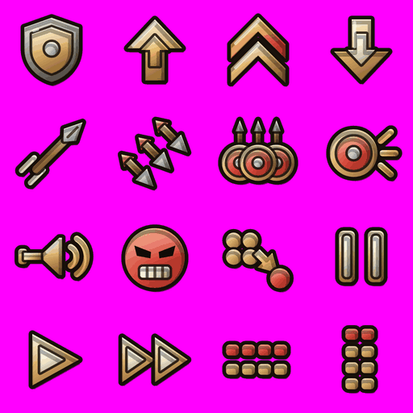

| Cell | Row, col | Pixel box (x, y) | ID | Meaning in the game | Shape to draw |
| --- | --- | --- | --- | --- | --- |
| 1 | R1 C1 | 0-255, 0-255 | `ui:hold` | Order: Hold. The group stands its ground. | an upright heater-shaped shield, dark iron rim, bronze face, a round steel boss in the centre, front view |
| 2 | R1 C2 | 256-511, 0-255 | `ui:advance` | Order: Advance. | a thick bronze arrow pointing straight up, a smaller gold arrow inlaid in its centre |
| 3 | R1 C3 | 512-767, 0-255 | `ui:charge` | Order: Charge. | two thick stacked chevrons pointing up, the upper one fiery orange, the lower one bronze |
| 4 | R1 C4 | 768-1023, 0-255 | `ui:fallback` | Order: Fall back. | a thick bronze arrow pointing straight down, a smaller ivory arrow inlaid in its centre |
| 5 | R2 C1 | 0-255, 256-511 | `ui:throw` | Order: Throw javelins. | a single javelin flying diagonally from lower-left to upper-right, wooden shaft, leaf-shaped steel head at the upper right, two short ivory speed streaks behind the tail |
| 6 | R2 C2 | 256-511, 256-511 | `ui:volley` | Ability: Volley (arrows / sling stones in a salvo). | three parallel arrows flying diagonally to the upper right, steel heads, wooden shafts, red fletching |
| 7 | R2 C3 | 512-767, 256-511 | `ui:wall` | Order: Shield wall. | three overlapping round bronze shields in a row with red faces and steel bosses, three spear tips standing up behind them |
| 8 | R2 C4 | 768-1023, 256-511 | `ui:bash` | Ability: Shield bash. Also the empty state of the abilities tab. | a round bronze shield with a red face and steel boss, front view, short gold impact lines bursting out of its right side |
| 9 | R3 C1 | 0-255, 512-767 | `ui:rally` | Ability: Rally (restores morale). | a straight bronze war trumpet lying horizontally, mouthpiece left, flared gold bell right, two curved gold sound waves to the right of the bell |
| 10 | R3 C2 | 256-511, 512-767 | `ui:berserk` | Ability: Berserk. | a round red furious face, dark slanted angry eyebrows, clenched ivory teeth |
| 11 | R3 C3 | 512-767, 512-767 | `ui:detach` | Command: Solo, detach a unit from its group. | four small bronze round tokens packed in a square at the upper left, one red token breaking away to the lower right, a short gold arrow from the group to the red token |
| 12 | R3 C4 | 768-1023, 512-767 | `ui:pause` | Battle speed: Pause. | a pause symbol: two upright rounded bronze bars with ivory inlays |
| 13 | R4 C1 | 0-255, 768-1023 | `ui:play` | Battle speed: Normal (play). | a play symbol: one bronze triangle pointing right with an ivory inlay |
| 14 | R4 C2 | 256-511, 768-1023 | `ui:fast` | Battle speed: Fast. | a fast-forward symbol: two bronze triangles pointing right side by side, ivory inlays |
| 15 | R4 C3 | 512-767, 768-1023 | `ui:f_line` | Formation: Line. | seen from above: soldiers as small rounded square tokens in two straight horizontal ranks of four, the top rank red, the bottom rank bronze |
| 16 | R4 C4 | 768-1023, 768-1023 | `ui:f_column` | Formation: Column. | seen from above: small rounded square tokens in a narrow vertical column two wide and four deep, the top pair red, the rest bronze |

Sheet prompt:

```text
Sheet 01 of 15: battle orders and speed.
Cells, in reading order:
1. (row 1, column 1) An upright heater-shaped shield, dark iron rim, bronze face, a round steel boss in the centre, front view.
2. (row 1, column 2) A thick bronze arrow pointing straight up, a smaller gold arrow inlaid in its centre.
3. (row 1, column 3) Two thick stacked chevrons pointing up, the upper one fiery orange, the lower one bronze.
4. (row 1, column 4) A thick bronze arrow pointing straight down, a smaller ivory arrow inlaid in its centre.
5. (row 2, column 1) A single javelin flying diagonally from lower-left to upper-right, wooden shaft, leaf-shaped steel head at the upper right, two short ivory speed streaks behind the tail.
6. (row 2, column 2) Three parallel arrows flying diagonally to the upper right, steel heads, wooden shafts, red fletching.
7. (row 2, column 3) Three overlapping round bronze shields in a row with red faces and steel bosses, three spear tips standing up behind them.
8. (row 2, column 4) A round bronze shield with a red face and steel boss, front view, short gold impact lines bursting out of its right side.
9. (row 3, column 1) A straight bronze war trumpet lying horizontally, mouthpiece left, flared gold bell right, two curved gold sound waves to the right of the bell.
10. (row 3, column 2) A round red furious face, dark slanted angry eyebrows, clenched ivory teeth.
11. (row 3, column 3) Four small bronze round tokens packed in a square at the upper left, one red token breaking away to the lower right, a short gold arrow from the group to the red token.
12. (row 3, column 4) A pause symbol: two upright rounded bronze bars with ivory inlays.
13. (row 4, column 1) A play symbol: one bronze triangle pointing right with an ivory inlay.
14. (row 4, column 2) A fast-forward symbol: two bronze triangles pointing right side by side, ivory inlays.
15. (row 4, column 3) Seen from above: soldiers as small rounded square tokens in two straight horizontal ranks of four, the top rank red, the bottom rank bronze.
16. (row 4, column 4) Seen from above: small rounded square tokens in a narrow vertical column two wide and four deep, the top pair red, the rest bronze.
```

## Sheet 02: Formations and unit status

File: `sheet-02.png`. Current icons in the same cells: [current/sheet-02.png](current/sheet-02.png)

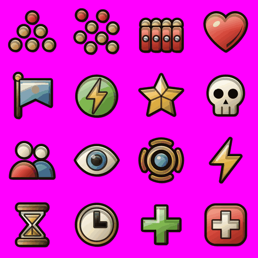

| Cell | Row, col | Pixel box (x, y) | ID | Meaning in the game | Shape to draw |
| --- | --- | --- | --- | --- | --- |
| 1 | R1 C1 | 0-255, 0-255 | `ui:f_wedge` | Formation: Wedge. | seen from above: round tokens arranged in a triangle pointing up, one red token at the apex, then two and three bronze tokens below |
| 2 | R1 C2 | 256-511, 0-255 | `ui:f_skirm` | Formation: Skirmish (loose order). | seen from above: eight round tokens scattered loosely with wide irregular gaps, two red ones at the front, the rest bronze |
| 3 | R1 C3 | 512-767, 0-255 | `ui:f_wall` | Formation: Shield wall (testudo-like block). | front view of four tall red rectangular shields standing edge to edge, bronze rims, a small steel boss on each |
| 4 | R1 C4 | 768-1023, 0-255 | `ui:heart` | Health / hit points. | a glossy red heart |
| 5 | R2 C1 | 0-255, 256-511 | `ui:morale` | Morale. | a blue square banner on a wooden pole with a gold finial, the cloth flying to the right, a small ivory dot emblem in its middle |
| 6 | R2 C2 | 256-511, 256-511 | `ui:stamina` | Stamina / fatigue. | a green round medallion with a gold lightning bolt across it |
| 7 | R2 C3 | 512-767, 256-511 | `ui:star` | Ladder floor rating and level-up. Reserved: never used for a currency. | a faceted five-pointed gold star with sharp points |
| 8 | R2 C4 | 768-1023, 256-511 | `ui:skull` | Kills, losses, dead men. | an ivory human skull, front view, dark eye sockets |
| 9 | R3 C1 | 0-255, 512-767 | `ui:people` | Men in a group, army size, clan members. | two busts side by side, ivory heads, one red tunic in front, one blue tunic slightly behind |
| 10 | R3 C2 | 256-511, 512-767 | `ui:eye` | Watch / follow camera, inspect, filter, zoom. | an almond-shaped ivory eye with a blue iris and a black pupil |
| 11 | R3 C3 | 512-767, 512-767 | `ui:aura` | Hero aura (abilities tab), an unknown ability. | a blue gem set in a gold ring, four curved orange flame arcs around it like a halo |
| 12 | R3 C4 | 768-1023, 512-767 | `ui:bolt` | Energy (war map attacks). | a single gold zig-zag lightning bolt |
| 13 | R4 C1 | 0-255, 768-1023 | `ui:hourglass` | Waiting, building in progress, time to go. | an hourglass with wooden top and bottom caps and golden sand in the glass |
| 14 | R4 C2 | 256-511, 768-1023 | `ui:clock` | Time left, cooldown, season end. | a round clock with a bronze rim, ivory dial and two dark hands |
| 15 | R4 C3 | 512-767, 768-1023 | `ui:plus` | Add, upgrade, heal. | a thick green plus sign |
| 16 | R4 C4 | 768-1023, 768-1023 | `ui:cross` | Wounded / hurt. | a red rounded square with a white medical cross |

Sheet prompt:

```text
Sheet 02 of 15: formations and unit status.
Cells, in reading order:
1. (row 1, column 1) Seen from above: round tokens arranged in a triangle pointing up, one red token at the apex, then two and three bronze tokens below.
2. (row 1, column 2) Seen from above: eight round tokens scattered loosely with wide irregular gaps, two red ones at the front, the rest bronze.
3. (row 1, column 3) Front view of four tall red rectangular shields standing edge to edge, bronze rims, a small steel boss on each.
4. (row 1, column 4) A glossy red heart.
5. (row 2, column 1) A blue square banner on a wooden pole with a gold finial, the cloth flying to the right, a small ivory dot emblem in its middle.
6. (row 2, column 2) A green round medallion with a gold lightning bolt across it.
7. (row 2, column 3) A faceted five-pointed gold star with sharp points.
8. (row 2, column 4) An ivory human skull, front view, dark eye sockets.
9. (row 3, column 1) Two busts side by side, ivory heads, one red tunic in front, one blue tunic slightly behind.
10. (row 3, column 2) An almond-shaped ivory eye with a blue iris and a black pupil.
11. (row 3, column 3) A blue gem set in a gold ring, four curved orange flame arcs around it like a halo.
12. (row 3, column 4) A single gold zig-zag lightning bolt.
13. (row 4, column 1) An hourglass with wooden top and bottom caps and golden sand in the glass.
14. (row 4, column 2) A round clock with a bronze rim, ivory dial and two dark hands.
15. (row 4, column 3) A thick green plus sign.
16. (row 4, column 4) A red rounded square with a white medical cross.
```

## Sheet 03: Equipment slots, auras and navigation

File: `sheet-03.png`. Current icons in the same cells: [current/sheet-03.png](current/sheet-03.png)

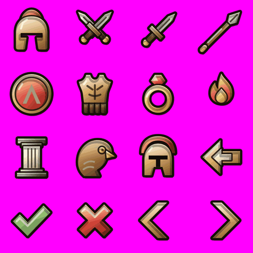

| Cell | Row, col | Pixel box (x, y) | ID | Meaning in the game | Shape to draw |
| --- | --- | --- | --- | --- | --- |
| 1 | R1 C1 | 0-255, 0-255 | `ui:helmet` | Helmet slot. | a bronze Greek helmet, front view, T-shaped face opening, a red horsehair crest on top |
| 2 | R1 C2 | 256-511, 0-255 | `ui:swords` | Battle, fight, attack. | two short swords crossed in an X, steel blades, gold cross-guards, leather grips, bronze pommels |
| 3 | R1 C3 | 512-767, 0-255 | `ui:sword` | Weapon slot (duel army). | a single short sword, diagonal, tip to the upper right, steel blade, gold guard, leather grip |
| 4 | R1 C4 | 768-1023, 0-255 | `ui:spear` | Weapon slot (hero sheet). | a spear, diagonal, wooden shaft, bronze socket, leaf-shaped steel head at the upper right |
| 5 | R2 C1 | 0-255, 256-511 | `ui:shield` | Shield slot. | a round bronze hoplite shield, front view, red face with an ivory lambda emblem |
| 6 | R2 C2 | 256-511, 256-511 | `ui:armor` | Armour slot. | a leather cuirass, front view, bronze collar, a row of hanging leather strips at the bottom |
| 7 | R2 C3 | 512-767, 256-511 | `ui:ring` | Trinket slot. | a gold ring with a red gem on top, 3/4 view |
| 8 | R2 C4 | 768-1023, 256-511 | `ui:fire` | Camp: campfire. | a small campfire, two crossed logs, an orange flame with a yellow core |
| 9 | R3 C1 | 0-255, 512-767 | `ui:aura_steady` | Aura: Steady. | a white marble Doric column with grey stone base and capital |
| 10 | R3 C2 | 256-511, 512-767 | `ui:aura_eagle` | Aura: Eagle. | the head of a brown eagle in profile facing right, gold hooked beak, gold eye |
| 11 | R3 C3 | 512-767, 512-767 | `ui:aura_warlord` | Aura: Warlord. | a bronze Corinthian helmet, front view, a tall red horsehair crest |
| 12 | R3 C4 | 768-1023, 512-767 | `ui:back` | Back. | a thick bronze arrow pointing left, a smaller ivory arrow inlaid in its centre |
| 13 | R4 C1 | 0-255, 768-1023 | `ui:check` | Confirm, done, learned. | a thick green check mark |
| 14 | R4 C2 | 256-511, 768-1023 | `ui:close` | Close, cancel, no. | a thick red X |
| 15 | R4 C3 | 512-767, 768-1023 | `ui:chevL` | Previous (pagers, steppers). | one thick bronze chevron pointing left |
| 16 | R4 C4 | 768-1023, 768-1023 | `ui:chevR` | Next (pagers, steppers). | one thick bronze chevron pointing right |

Sheet prompt:

```text
Sheet 03 of 15: equipment slots, auras and navigation.
Cells, in reading order:
1. (row 1, column 1) A bronze Greek helmet, front view, T-shaped face opening, a red horsehair crest on top.
2. (row 1, column 2) Two short swords crossed in an X, steel blades, gold cross-guards, leather grips, bronze pommels.
3. (row 1, column 3) A single short sword, diagonal, tip to the upper right, steel blade, gold guard, leather grip.
4. (row 1, column 4) A spear, diagonal, wooden shaft, bronze socket, leaf-shaped steel head at the upper right.
5. (row 2, column 1) A round bronze hoplite shield, front view, red face with an ivory lambda emblem.
6. (row 2, column 2) A leather cuirass, front view, bronze collar, a row of hanging leather strips at the bottom.
7. (row 2, column 3) A gold ring with a red gem on top, 3/4 view.
8. (row 2, column 4) A small campfire, two crossed logs, an orange flame with a yellow core.
9. (row 3, column 1) A white marble Doric column with grey stone base and capital.
10. (row 3, column 2) The head of a brown eagle in profile facing right, gold hooked beak, gold eye.
11. (row 3, column 3) A bronze Corinthian helmet, front view, a tall red horsehair crest.
12. (row 3, column 4) A thick bronze arrow pointing left, a smaller ivory arrow inlaid in its centre.
13. (row 4, column 1) A thick green check mark.
14. (row 4, column 2) A thick red X.
15. (row 4, column 3) One thick bronze chevron pointing left.
16. (row 4, column 4) One thick bronze chevron pointing right.
```

## Sheet 04: Tools and menus

File: `sheet-04.png`. Current icons in the same cells: [current/sheet-04.png](current/sheet-04.png)

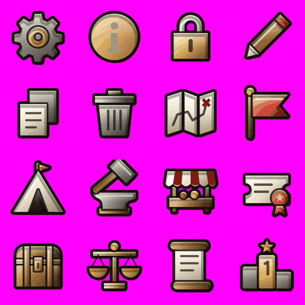

| Cell | Row, col | Pixel box (x, y) | ID | Meaning in the game | Shape to draw |
| --- | --- | --- | --- | --- | --- |
| 1 | R1 C1 | 0-255, 0-255 | `ui:gear` | Settings. | an iron cog wheel with a bronze hub |
| 2 | R1 C2 | 256-511, 0-255 | `ui:info` | Info, help, explain. | a round bronze disc with a bold ivory lowercase letter i |
| 3 | R1 C3 | 512-767, 0-255 | `ui:lock` | Locked. Reserved: only for locked things. | a padlock, steel shackle, bronze body, dark keyhole |
| 4 | R1 C4 | 768-1023, 0-255 | `ui:pen` | Rename, edit. | a pencil lying diagonally, wooden body, ivory tip at the lower left, red end at the upper right |
| 5 | R2 C1 | 0-255, 256-511 | `ui:copy` | Copy (army preset, code). | two overlapping sheets of paper, the back one grey, the front one ivory with three text lines |
| 6 | R2 C2 | 256-511, 256-511 | `ui:bin` | Delete. | an iron waste bin with a lid and vertical ribs |
| 7 | R2 C3 | 512-767, 256-511 | `ui:map` | World map, campaign map. | a folded parchment map in three panels, a dotted route line, a small red X |
| 8 | R2 C4 | 768-1023, 256-511 | `ui:flag` | Clan, banner, claim, sell. | a red swallow-tailed pennant on a wooden pole with a gold finial |
| 9 | R3 C1 | 0-255, 512-767 | `ui:tent` | Camp, rest. | a white canvas tent with a dark doorway and a small red pennant on top |
| 10 | R3 C2 | 256-511, 512-767 | `ui:repair` | Repair gear. | a smith's hammer, wooden handle and iron head, striking a small iron anvil |
| 11 | R3 C3 | 512-767, 512-767 | `ui:shop` | Shop. Reserved: only for the shop. | a market stall, red-and-white striped awning on wooden posts over a counter holding clay pots and gold coins |
| 12 | R3 C4 | 768-1023, 512-767 | `ui:pass` | Season pass. | a parchment ticket with text lines and a red wax seal with ribbon tails at the lower right |
| 13 | R4 C1 | 0-255, 768-1023 | `ui:chest` | Reward chest (duels, results). | a closed wooden treasure chest with bronze bands and a gold lock plate |
| 14 | R4 C2 | 256-511, 768-1023 | `ui:scales` | Point budget of a duel army. | bronze balance scales with two gold pans hanging level and a gold knob on top |
| 15 | R4 C3 | 512-767, 768-1023 | `ui:log` | Raid log, history. | an open papyrus scroll with wooden rollers at top and bottom and text lines |
| 16 | R4 C4 | 768-1023, 768-1023 | `ui:podium` | Leaderboards. Reserved. | a three-step stone podium, the tall middle step gold with an engraved numeral 1 (the only number allowed in the whole set), a small gold star above it |

Sheet prompt:

```text
Sheet 04 of 15: tools and menus.
Cells, in reading order:
1. (row 1, column 1) An iron cog wheel with a bronze hub.
2. (row 1, column 2) A round bronze disc with a bold ivory lowercase letter i.
3. (row 1, column 3) A padlock, steel shackle, bronze body, dark keyhole.
4. (row 1, column 4) A pencil lying diagonally, wooden body, ivory tip at the lower left, red end at the upper right.
5. (row 2, column 1) Two overlapping sheets of paper, the back one grey, the front one ivory with three text lines.
6. (row 2, column 2) An iron waste bin with a lid and vertical ribs.
7. (row 2, column 3) A folded parchment map in three panels, a dotted route line, a small red X.
8. (row 2, column 4) A red swallow-tailed pennant on a wooden pole with a gold finial.
9. (row 3, column 1) A white canvas tent with a dark doorway and a small red pennant on top.
10. (row 3, column 2) A smith's hammer, wooden handle and iron head, striking a small iron anvil.
11. (row 3, column 3) A market stall, red-and-white striped awning on wooden posts over a counter holding clay pots and gold coins.
12. (row 3, column 4) A parchment ticket with text lines and a red wax seal with ribbon tails at the lower right.
13. (row 4, column 1) A closed wooden treasure chest with bronze bands and a gold lock plate.
14. (row 4, column 2) Bronze balance scales with two gold pans hanging level and a gold knob on top.
15. (row 4, column 3) An open papyrus scroll with wooden rollers at top and bottom and text lines.
16. (row 4, column 4) A three-step stone podium, the tall middle step gold with an engraved numeral 1 (the only number allowed in the whole set), a small gold star above it.
```

## Sheet 05: Modes and currencies

File: `sheet-05.png`. Current icons in the same cells: [current/sheet-05.png](current/sheet-05.png)

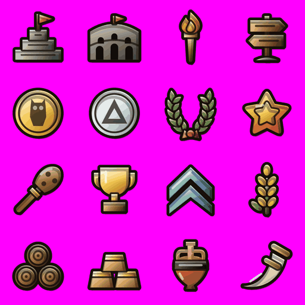

| Cell | Row, col | Pixel box (x, y) | ID | Meaning in the game | Shape to draw |
| --- | --- | --- | --- | --- | --- |
| 1 | R1 C1 | 0-255, 0-255 | `ui:ladder` | Duels: Ladder mode. | a stepped stone tower of three tiers with a red pennant on top |
| 2 | R1 C2 | 256-511, 0-255 | `ui:arena` | Duels: Arena mode. | a grey stone amphitheatre facade with two rows of dark arches and a small red flag on top |
| 3 | R1 C3 | 512-767, 0-255 | `ui:raid` | Raids. | a burning torch, wooden handle, bronze cup, orange-yellow flame |
| 4 | R1 C4 | 768-1023, 0-255 | `ui:march` | Campaign. | a wooden signpost with two arrow boards pointing left and right, on a stone base |
| 5 | R2 C1 | 0-255, 256-511 | `ui:coin` | Gold (campaign and war gold). Resource icon. | a gold coin, face-on, thick rim, a dark embossed owl in the centre |
| 6 | R2 C2 | 256-511, 256-511 | `ui:drachma` | Drachmae (premium currency). Resource icon. | a silver coin, face-on, thick rim, a dark embossed triangle (Greek delta) in the centre |
| 7 | R2 C3 | 512-767, 256-511 | `ui:laurel` | Glory. Resource icon. | a green laurel wreath open at the top, tied with a red ribbon at the bottom |
| 8 | R2 C4 | 768-1023, 256-511 | `ui:tgstar` | Telegram Stars (real money). Must not look like the gold rating star. | a fat, puffy, rounded five-point star, orange outside with a yellow inner star, like the Telegram Stars symbol |
| 9 | R3 C1 | 0-255, 512-767 | `ui:power` | Power (army strength). Resource icon. | Herakles' club: a knobbly wooden club, diagonal, thick end upper right, a gold band at the grip |
| 10 | R3 C2 | 256-511, 512-767 | `ui:trophy` | Wins. Resource icon. | a gold two-handled victor's cup on a wooden base |
| 11 | R3 C3 | 512-767, 512-767 | `ui:xp` | Experience (XP). Resource icon. | two stacked blue chevrons pointing up |
| 12 | R3 C4 | 768-1023, 512-767 | `ui:food` | Food (resource bar, small). | a single golden wheat ear on a green stalk with two leaves |
| 13 | R4 C1 | 0-255, 768-1023 | `ui:wood` | Wood (resource bar, small). | three log ends stacked in a pyramid, cut faces with growth rings |
| 14 | R4 C2 | 256-511, 768-1023 | `ui:bronze` | Bronze (resource bar, small). | three bronze ingots stacked in a pyramid |
| 15 | R4 C3 | 512-767, 768-1023 | `ui:amphora` | Loot, merchant, trade. | a terracotta amphora with two handles and a dark band round the neck |
| 16 | R4 C4 | 768-1023, 768-1023 | `ui:horn` | Battle: blow the war horn. | a curved ivory animal horn, pointed tip at the lower left, curving up to a wide mouth at the upper right ringed with two bronze bands |

Sheet prompt:

```text
Sheet 05 of 15: modes and currencies.
Cells, in reading order:
1. (row 1, column 1) A stepped stone tower of three tiers with a red pennant on top.
2. (row 1, column 2) A grey stone amphitheatre facade with two rows of dark arches and a small red flag on top.
3. (row 1, column 3) A burning torch, wooden handle, bronze cup, orange-yellow flame.
4. (row 1, column 4) A wooden signpost with two arrow boards pointing left and right, on a stone base.
5. (row 2, column 1) A gold coin, face-on, thick rim, a dark embossed owl in the centre.
6. (row 2, column 2) A silver coin, face-on, thick rim, a dark embossed triangle (Greek delta) in the centre.
7. (row 2, column 3) A green laurel wreath open at the top, tied with a red ribbon at the bottom.
8. (row 2, column 4) A fat, puffy, rounded five-point star, orange outside with a yellow inner star, like the Telegram Stars symbol.
9. (row 3, column 1) Herakles' club: a knobbly wooden club, diagonal, thick end upper right, a gold band at the grip.
10. (row 3, column 2) A gold two-handled victor's cup on a wooden base.
11. (row 3, column 3) Two stacked blue chevrons pointing up.
12. (row 3, column 4) A single golden wheat ear on a green stalk with two leaves.
13. (row 4, column 1) Three log ends stacked in a pyramid, cut faces with growth rings.
14. (row 4, column 2) Three bronze ingots stacked in a pyramid.
15. (row 4, column 3) A terracotta amphora with two handles and a dark band round the neck.
16. (row 4, column 4) A curved ivory animal horn, pointed tip at the lower left, curving up to a wide mouth at the upper right ringed with two bronze bands.
```

## Sheet 06: Camp, status badges and resources

File: `sheet-06.png`. Current icons in the same cells: [current/sheet-06.png](current/sheet-06.png)

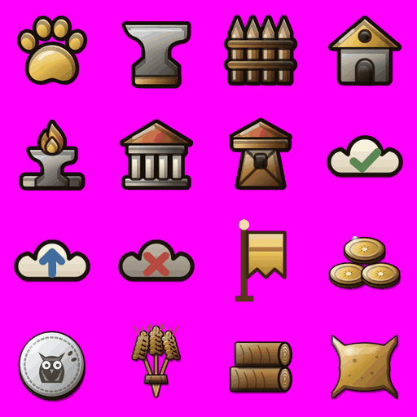

| Cell | Row, col | Pixel box (x, y) | ID | Meaning in the game | Shape to draw |
| --- | --- | --- | --- | --- | --- |
| 1 | R1 C1 | 0-255, 0-255 | `ui:beast` | Mythic beasts, beast trials. | a golden paw print, four toes and a pad |
| 2 | R1 C2 | 256-511, 0-255 | `ui:anvil` | Build, forge. | an iron anvil standing on a wooden block |
| 3 | R1 C3 | 512-767, 0-255 | `camp:palisade` | Camp building: Palisade. | a wooden palisade of five sharpened stakes lashed to two horizontal rails |
| 4 | R1 C4 | 768-1023, 0-255 | `camp:granary` | Camp building: Granary. | a small stone granary with a golden thatched gable roof, a round vent and an arched door |
| 5 | R2 C1 | 0-255, 256-511 | `camp:forge` | Camp building: Forge. | a grey anvil on a stone plinth with a flame burning above it |
| 6 | R2 C2 | 256-511, 256-511 | `camp:barracks` | Camp building: Barracks. | a small Greek temple, red tiled pediment roof, four white columns, stone steps |
| 7 | R2 C3 | 512-767, 256-511 | `camp:watchtower` | Camp building: Watchtower. | a wooden watchtower with a red pyramid roof and splayed legs |
| 8 | R2 C4 | 768-1023, 256-511 | `chrome:sync_synced` | Cloud save: synced. Shown at 12 x 7 UI px. | a wide cream cloud (about 12:7 wide) with a green check mark on it |
| 9 | R3 C1 | 0-255, 512-767 | `chrome:sync_syncing` | Cloud save: syncing. | a wide cream cloud (about 12:7 wide) with a blue up arrow on it |
| 10 | R3 C2 | 256-511, 512-767 | `chrome:sync_offline` | Cloud save: offline / local only. | a wide grey cloud (about 12:7 wide) with a red X on it |
| 11 | R3 C3 | 512-767, 512-767 | `chrome:supporter_banner` | Supporter badge beside a name (8 x 12 UI px, also shown mirrored). | a tall narrow standard: a wooden pole with a gold ball finial and a gold swallow-tailed banner hanging to the right |
| 12 | R3 C4 | 768-1023, 512-767 | `goods:gold` | Gold as a good (wallet, rewards, trade). | a small pile of three gold coins |
| 13 | R4 C1 | 0-255, 768-1023 | `goods:drachmae` | Drachmae as a good (wallet, shop). | a large silver coin with an embossed owl of Athena |
| 14 | R4 C2 | 256-511, 768-1023 | `goods:food` | Food as a good. | a sheaf of golden wheat ears tied with a band |
| 15 | R4 C3 | 512-767, 768-1023 | `goods:wood` | Wood as a good. | two cut logs lying stacked, the cut ends facing the viewer on the right |
| 16 | R4 C4 | 768-1023, 768-1023 | `goods:bronze` | Bronze as a good. | a bronze oxhide ingot: a flat slab with four flared corners and concave sides |

Sheet prompt:

```text
Sheet 06 of 15: camp, status badges and resources.
Cells, in reading order:
1. (row 1, column 1) A golden paw print, four toes and a pad.
2. (row 1, column 2) An iron anvil standing on a wooden block.
3. (row 1, column 3) A wooden palisade of five sharpened stakes lashed to two horizontal rails.
4. (row 1, column 4) A small stone granary with a golden thatched gable roof, a round vent and an arched door.
5. (row 2, column 1) A grey anvil on a stone plinth with a flame burning above it.
6. (row 2, column 2) A small Greek temple, red tiled pediment roof, four white columns, stone steps.
7. (row 2, column 3) A wooden watchtower with a red pyramid roof and splayed legs.
8. (row 2, column 4) A wide cream cloud (about 12:7 wide) with a green check mark on it.
9. (row 3, column 1) A wide cream cloud (about 12:7 wide) with a blue up arrow on it.
10. (row 3, column 2) A wide grey cloud (about 12:7 wide) with a red X on it.
11. (row 3, column 3) A tall narrow standard: a wooden pole with a gold ball finial and a gold swallow-tailed banner hanging to the right.
12. (row 3, column 4) A small pile of three gold coins.
13. (row 4, column 1) A large silver coin with an embossed owl of Athena.
14. (row 4, column 2) A sheaf of golden wheat ears tied with a band.
15. (row 4, column 3) Two cut logs lying stacked, the cut ends facing the viewer on the right.
16. (row 4, column 4) A bronze oxhide ingot: a flat slab with four flared corners and concave sides.
```

## Sheet 07: Goods and weapons

File: `sheet-07.png`. Current icons in the same cells: [current/sheet-07.png](current/sheet-07.png)

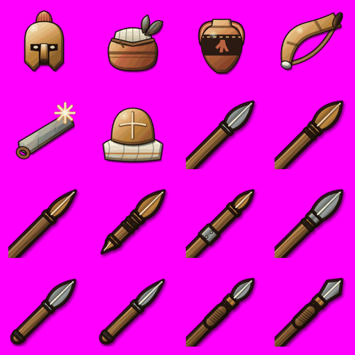

| Cell | Row, col | Pixel box (x, y) | ID | Meaning in the game | Shape to draw |
| --- | --- | --- | --- | --- | --- |
| 1 | R1 C1 | 0-255, 0-255 | `goods:recruits` | Recruits (new men). | a bronze Corinthian helmet, front view, a red crest |
| 2 | R1 C2 | 256-511, 0-255 | `goods:healing_salve` | Consumable: Healing salve. | a squat terracotta jar with a linen cover tied with cord and a green leaf sprig |
| 3 | R1 C3 | 512-767, 0-255 | `goods:morale_wine` | Consumable: Wine (morale). | a red-figure terracotta amphora with a black painted band |
| 4 | R1 C4 | 768-1023, 0-255 | `goods:war_horn` | Consumable: War horn. | a long curved ox horn with a leather carrying strap |
| 5 | R2 C1 | 0-255, 256-511 | `goods:sharpening_stone` | Consumable: Sharpening stone. | a grey whetstone bar, diagonal, a leather loop at one end and a bright spark at the other |
| 6 | R2 C2 | 256-511, 256-511 | `goods:march_rations` | Consumable: March rations. | a round loaf of bread with a cross scored on top, on a folded linen cloth |
| 7 | R2 C3 | 512-767, 256-511 | `item:dory` | Weapon, tier 1: **Dory spear**. Long thrusting spear. Reach; braces against charges. | a long spear: plain wooden shaft, leaf-shaped iron head, small bronze butt-spike |
| 8 | R2 C4 | 768-1023, 256-511 | `item:bronze_dory` | Weapon, tier 2: **Bronze-shod dory**. A finer spear with a heavy bronze head. | a long spear with a heavy, broad bronze leaf-shaped head and a bronze collar, wooden shaft |
| 9 | R3 C1 | 0-255, 512-767 | `item:ash_dory` | Weapon, tier 1: **Ash-wood dory**. A long, plain ash shaft: outreaches the dory, hits a little softer. | a very long, plain pale ash-wood spear with a small narrow iron head |
| 10 | R3 C2 | 256-511, 512-767 | `item:sauroter_dory` | Weapon, tier 3: **Sauroter dory**. Balanced by its bronze butt-spike, the "lizard-killer". A veteran's spear. | a long spear with an iron leaf head and a big square-sectioned bronze butt-spike (sauroter) clearly visible at the lower left |
| 11 | R3 C3 | 512-767, 512-767 | `item:sarissa` | Weapon, tier 2: **Sarissa**. Macedonian pike. Two-handed: the longest reach in the line, but no shield. | an extremely long, thin Macedonian pike running from corner to corner, a bronze sleeve joining the shaft in the middle, a small iron head |
| 12 | R3 C4 | 768-1023, 512-767 | `item:hasta` | Weapon, tier 2: **Hasta**. Thrusting spear of the Italian third line: shorter than a dory, quicker. | a medium-length spear, sturdy dark wooden shaft, long narrow iron head |
| 13 | R4 C1 | 0-255, 768-1023 | `item:longche` | Weapon, tier 1: **Longche**. Short thrusting spear: quicker than the dory, less reach. | a short thrusting spear: thick wooden shaft, slim iron head on a bronze socket |
| 14 | R4 C2 | 256-511, 768-1023 | `item:lancea` | Weapon, tier 1: **Celtic leaf spear**. Broad iron leaf-blade on a short haft. Bites past a shield rim. | a short spear with a very broad iron leaf blade with a raised midrib |
| 15 | R4 C3 | 512-767, 768-1023 | `item:xyston` | Weapon, tier 2: **Xyston lance**. Long cornel-wood cavalry lance, butt-spiked. Wins the first clash. | a long pale cornel-wood cavalry lance, leather-wrapped grip in the middle, iron points at both ends |
| 16 | R4 C4 | 768-1023, 768-1023 | `item:kontos` | Weapon, tier 3: **Kontos**. Steppe lance held in both hands. Nothing hits harder in a charge. | a very thick, heavy steppe lance with a long iron head and a red pennon tied below the head |

Sheet prompt:

```text
Sheet 07 of 15: goods and weapons.
Weapons are drawn diagonally across the cell: grip / butt at the lower left, tip / blade at the
upper right, at the same 45 degree angle (bows stand upright, slings hang). Shields, helmets and armour are front views, upright.
Trinkets are small jewellery objects; when hanging from a cord, the cord's two ends go up to the
top of the icon area.
Items of one family (several spears, several helmets...) must be clearly different from each
other at a glance: follow each cell's shape, material and colour exactly.
Cells, in reading order:
1. (row 1, column 1) A bronze Corinthian helmet, front view, a red crest.
2. (row 1, column 2) A squat terracotta jar with a linen cover tied with cord and a green leaf sprig.
3. (row 1, column 3) A red-figure terracotta amphora with a black painted band.
4. (row 1, column 4) A long curved ox horn with a leather carrying strap.
5. (row 2, column 1) A grey whetstone bar, diagonal, a leather loop at one end and a bright spark at the other.
6. (row 2, column 2) A round loaf of bread with a cross scored on top, on a folded linen cloth.
7. (row 2, column 3) A long spear: plain wooden shaft, leaf-shaped iron head, small bronze butt-spike.
8. (row 2, column 4) A long spear with a heavy, broad bronze leaf-shaped head and a bronze collar, wooden shaft.
9. (row 3, column 1) A very long, plain pale ash-wood spear with a small narrow iron head.
10. (row 3, column 2) A long spear with an iron leaf head and a big square-sectioned bronze butt-spike (sauroter) clearly visible at the lower left.
11. (row 3, column 3) An extremely long, thin Macedonian pike running from corner to corner, a bronze sleeve joining the shaft in the middle, a small iron head.
12. (row 3, column 4) A medium-length spear, sturdy dark wooden shaft, long narrow iron head.
13. (row 4, column 1) A short thrusting spear: thick wooden shaft, slim iron head on a bronze socket.
14. (row 4, column 2) A short spear with a very broad iron leaf blade with a raised midrib.
15. (row 4, column 3) A long pale cornel-wood cavalry lance, leather-wrapped grip in the middle, iron points at both ends.
16. (row 4, column 4) A very thick, heavy steppe lance with a long iron head and a red pennon tied below the head.
```

## Sheet 08: Weapons

File: `sheet-08.png`. Current icons in the same cells: [current/sheet-08.png](current/sheet-08.png)

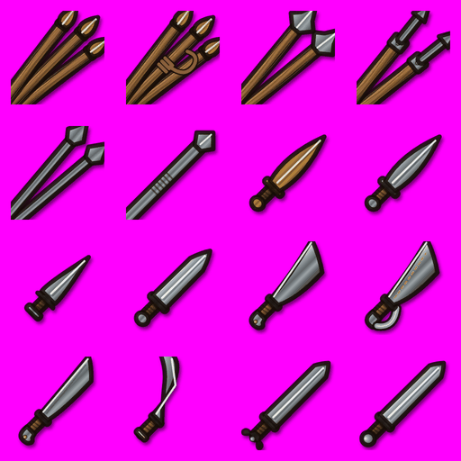

| Cell | Row, col | Pixel box (x, y) | ID | Meaning in the game | Shape to draw |
| --- | --- | --- | --- | --- | --- |
| 1 | R1 C1 | 0-255, 0-255 | `item:javelins` | Weapon, tier 1: **Akontia javelins**. Three heavy throws, then a short spear. | three wooden javelins, slightly fanned, small iron heads, a leather throwing loop on each shaft |
| 2 | R1 C2 | 256-511, 0-255 | `item:ankyle` | Weapon, tier 1: **Thonged darts**. Light darts flung with a finger-loop: five quick throws, longer range. | five short light darts fanned out, thin shafts, tiny iron tips, small finger loops |
| 3 | R1 C3 | 512-767, 0-255 | `item:gaesum` | Weapon, tier 2: **Gaesum**. Gallic iron javelin; the last one makes a fair charging spear. | two slender all-iron Gallic javelins with long barbed heads |
| 4 | R1 C4 | 768-1023, 0-255 | `item:pilum` | Weapon, tier 2: **Pilum**. Roman heavy javelin. Its soft shank bends in a shield and drags it down. | one Roman pilum: wooden lower shaft, long thin iron shank, small pyramid point, a square wooden block where wood meets iron |
| 5 | R2 C1 | 0-255, 256-511 | `item:saunion` | Weapon, tier 2: **Iron saunia**. All-iron javelins that pin shields. | two dark all-iron javelins with leaf-shaped heads |
| 6 | R2 C2 | 256-511, 256-511 | `item:soliferrum` | Weapon, tier 2: **Soliferrum**. Iberian javelin forged in one piece of iron. Two throws that go through anything. | one long, thin javelin forged from a single piece of dark iron, a barbed tip |
| 7 | R2 C3 | 512-767, 256-511 | `item:xiphos` | Weapon, tier 1: **Xiphos**. Short leaf-bladed sword. Quick. | a short Greek sword: leaf-shaped bronze blade, small cross-guard, wooden grip |
| 8 | R2 C4 | 768-1023, 256-511 | `item:iron_xiphos` | Weapon, tier 2: **Iron xiphos**. A xiphos in good forged iron: holds an edge and strikes fast. | a short leaf-shaped iron sword with a bronze cross-guard and a bone grip |
| 9 | R3 C1 | 0-255, 512-767 | `item:akinakes` | Weapon, tier 1: **Akinakes**. Persian and Scythian short sword, worn on the right thigh. Very quick. | a short straight Persian short-sword with a heart-shaped guard and a gold bar pommel |
| 10 | R3 C2 | 256-511, 512-767 | `item:gladius` | Weapon, tier 3: **Gladius hispaniensis**. The Spanish sword Rome adopted: a stabbing point in fine Celtiberian steel. | a Roman gladius: straight double-edged steel blade with a long point, ivory grip, round wooden pommel |
| 11 | R3 C3 | 512-767, 512-767 | `item:kopis` | Weapon, tier 2: **Kopis**. Forward-curved chopping sword. | a forward-curving single-edged iron chopping sword with a hooked grip |
| 12 | R3 C4 | 768-1023, 512-767 | `item:falcata` | Weapon, tier 3: **Falcata**. Iberian blade, feared in every port. | an Iberian falcata: heavy forward-curving iron blade, the hilt curled round into a bird-head guard |
| 13 | R4 C1 | 0-255, 768-1023 | `item:makhaira` | Weapon, tier 2: **Makhaira**. Heavy single-edged chopper. Slow, but its wounds unnerve. | a heavy single-edged iron cleaver-sword with a straight back, widening toward the tip |
| 14 | R4 C2 | 256-511, 768-1023 | `item:sica` | Weapon, tier 2: **Sica**. Thracian curved blade that hooks around a shield. Short and vicious. | a Thracian sica: a short iron blade curved sharply like a hook, wooden grip |
| 15 | R4 C3 | 512-767, 768-1023 | `item:longsword` | Weapon, tier 2: **Celtic longsword**. Long iron slashing sword. | a long straight Celtic iron sword, simple cross-guard, round pommel |
| 16 | R4 C4 | 768-1023, 768-1023 | `item:chieftain_sword` | Weapon, tier 3: **Chieftain's longsword**. Pattern-welded blade in a bronze-mounted scabbard. Men break before it. | a long pattern-welded steel sword lying beside its bronze-mounted scabbard decorated with swirls |

Sheet prompt:

```text
Sheet 08 of 15: weapons.
Weapons are drawn diagonally across the cell: grip / butt at the lower left, tip / blade at the
upper right, at the same 45 degree angle (bows stand upright, slings hang). Shields, helmets and armour are front views, upright.
Trinkets are small jewellery objects; when hanging from a cord, the cord's two ends go up to the
top of the icon area.
Items of one family (several spears, several helmets...) must be clearly different from each
other at a glance: follow each cell's shape, material and colour exactly.
Cells, in reading order:
1. (row 1, column 1) Three wooden javelins, slightly fanned, small iron heads, a leather throwing loop on each shaft.
2. (row 1, column 2) Five short light darts fanned out, thin shafts, tiny iron tips, small finger loops.
3. (row 1, column 3) Two slender all-iron Gallic javelins with long barbed heads.
4. (row 1, column 4) One Roman pilum: wooden lower shaft, long thin iron shank, small pyramid point, a square wooden block where wood meets iron.
5. (row 2, column 1) Two dark all-iron javelins with leaf-shaped heads.
6. (row 2, column 2) One long, thin javelin forged from a single piece of dark iron, a barbed tip.
7. (row 2, column 3) A short Greek sword: leaf-shaped bronze blade, small cross-guard, wooden grip.
8. (row 2, column 4) A short leaf-shaped iron sword with a bronze cross-guard and a bone grip.
9. (row 3, column 1) A short straight Persian short-sword with a heart-shaped guard and a gold bar pommel.
10. (row 3, column 2) A Roman gladius: straight double-edged steel blade with a long point, ivory grip, round wooden pommel.
11. (row 3, column 3) A forward-curving single-edged iron chopping sword with a hooked grip.
12. (row 3, column 4) An Iberian falcata: heavy forward-curving iron blade, the hilt curled round into a bird-head guard.
13. (row 4, column 1) A heavy single-edged iron cleaver-sword with a straight back, widening toward the tip.
14. (row 4, column 2) A Thracian sica: a short iron blade curved sharply like a hook, wooden grip.
15. (row 4, column 3) A long straight Celtic iron sword, simple cross-guard, round pommel.
16. (row 4, column 4) A long pattern-welded steel sword lying beside its bronze-mounted scabbard decorated with swirls.
```

## Sheet 09: Weapons

File: `sheet-09.png`. Current icons in the same cells: [current/sheet-09.png](current/sheet-09.png)

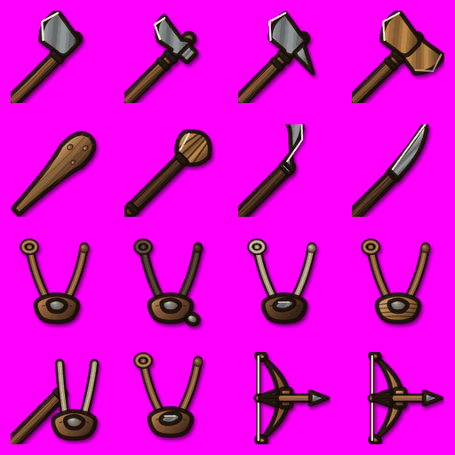

| Cell | Row, col | Pixel box (x, y) | ID | Meaning in the game | Shape to draw |
| --- | --- | --- | --- | --- | --- |
| 1 | R1 C1 | 0-255, 0-255 | `item:axe` | Weapon, tier 1: **War axe**. Slow, but splits shields. | a war axe: wooden haft, one bearded iron blade |
| 2 | R1 C2 | 256-511, 0-255 | `item:sagaris` | Weapon, tier 2: **Sagaris**. Steppe battle-axe with a pick at the back. Lighter and quicker than a war axe. | a slim steppe battle-axe on a long thin haft: a narrow axe blade on one side, a pick spike on the other |
| 3 | R1 C3 | 512-767, 0-255 | `item:dolabra` | Weapon, tier 2: **Dolabra**. A sapper's pick-axe. Digs ditches by day, opens shields by day too. | a Roman dolabra: stout haft, an axe blade on one side and a downward pick on the other |
| 4 | R1 C4 | 768-1023, 0-255 | `item:labrys` | Weapon, tier 3: **Cretan labrys**. Sacred double axe, swung in both hands. Terrible and slow. | a Cretan labrys: a symmetrical bronze double-headed axe on a long haft |
| 5 | R2 C1 | 0-255, 256-511 | `item:club` | Weapon, tier 1: **Club**. Knotted olive wood. Cracks nerves as well as skulls. | a heavy knobbly olive-wood club, thick end at the upper right |
| 6 | R2 C2 | 256-511, 256-511 | `item:bronze_mace` | Weapon, tier 2: **Bronze mace**. Flanged bronze head on a short haft. Rings helmets like bells. | a short mace: wooden haft, flanged bronze head |
| 7 | R2 C3 | 512-767, 256-511 | `item:falx` | Weapon, tier 2: **Falx**. Two-handed Dacian sickle-blade. Hooks shields aside. | a Dacian falx: long wooden haft with an inward-curving sickle-like iron blade |
| 8 | R2 C4 | 768-1023, 256-511 | `item:rhomphaia` | Weapon, tier 2: **Rhomphaia**. Thracian long blade on a long haft. Cleaves helmets and shields. | a Thracian rhomphaia: long haft with a long, slightly curved iron blade |
| 9 | R3 C1 | 0-255, 512-767 | `item:sling` | Weapon, tier 1: **Sling**. Stones at long range: they bruise through armour. | a plain leather sling hanging in a V, a stone in the pouch, a finger loop at one end |
| 10 | R3 C2 | 256-511, 512-767 | `item:balearic_sling` | Weapon, tier 2: **Balearic sling**. Island slingers never miss twice. | three slings of different lengths coiled together, dark cords |
| 11 | R3 C3 | 512-767, 512-767 | `item:rhodian_sling` | Weapon, tier 2: **Rhodian sling**. Cast lead bullets: they outrange Persian bows. | a coiled leather sling with three grey almond-shaped cast lead bullets beside it |
| 12 | R3 C4 | 768-1023, 512-767 | `item:shepherd_sling` | Weapon, tier 1: **Shepherd's sling**. Woven wool cords and a pouch of river stones: shorter range, quicker and plenty of shot. | a sling of woven striped cream-and-brown wool cords with a pouch holding river stones |
| 13 | R4 C1 | 0-255, 768-1023 | `item:staff_sling` | Weapon, tier 2: **Staff sling**. A sling on a staff, two-handed: heavy stones, slow to reload. | a wooden staff, diagonal, with a leather sling pouch hanging from its upper tip |
| 14 | R4 C2 | 256-511, 768-1023 | `item:achaean_sling` | Weapon, tier 3: **Achaean sling**. Triple-thonged sling of Aegion, where boys shoot at rings for their bread. | a sling of three braided leather thongs joined by a small bronze ring |
| 15 | R4 C3 | 512-767, 768-1023 | `item:bow` | Weapon, tier 2: **Composite bow**. Two-handed. Long range arrows. | a recurved composite bow of horn and wood standing upright, an arrow nocked and pointing right |
| 16 | R4 C4 | 768-1023, 768-1023 | `item:cretan_bow` | Weapon, tier 2: **Cretan bow**. Horn-backed bow of the island archers. The longest reach. | a long horn-backed bow standing upright, pale horn tips, one arrow nocked |

Sheet prompt:

```text
Sheet 09 of 15: weapons.
Weapons are drawn diagonally across the cell: grip / butt at the lower left, tip / blade at the
upper right, at the same 45 degree angle (bows stand upright, slings hang). Shields, helmets and armour are front views, upright.
Trinkets are small jewellery objects; when hanging from a cord, the cord's two ends go up to the
top of the icon area.
Items of one family (several spears, several helmets...) must be clearly different from each
other at a glance: follow each cell's shape, material and colour exactly.
Cells, in reading order:
1. (row 1, column 1) A war axe: wooden haft, one bearded iron blade.
2. (row 1, column 2) A slim steppe battle-axe on a long thin haft: a narrow axe blade on one side, a pick spike on the other.
3. (row 1, column 3) A Roman dolabra: stout haft, an axe blade on one side and a downward pick on the other.
4. (row 1, column 4) A Cretan labrys: a symmetrical bronze double-headed axe on a long haft.
5. (row 2, column 1) A heavy knobbly olive-wood club, thick end at the upper right.
6. (row 2, column 2) A short mace: wooden haft, flanged bronze head.
7. (row 2, column 3) A Dacian falx: long wooden haft with an inward-curving sickle-like iron blade.
8. (row 2, column 4) A Thracian rhomphaia: long haft with a long, slightly curved iron blade.
9. (row 3, column 1) A plain leather sling hanging in a V, a stone in the pouch, a finger loop at one end.
10. (row 3, column 2) Three slings of different lengths coiled together, dark cords.
11. (row 3, column 3) A coiled leather sling with three grey almond-shaped cast lead bullets beside it.
12. (row 3, column 4) A sling of woven striped cream-and-brown wool cords with a pouch holding river stones.
13. (row 4, column 1) A wooden staff, diagonal, with a leather sling pouch hanging from its upper tip.
14. (row 4, column 2) A sling of three braided leather thongs joined by a small bronze ring.
15. (row 4, column 3) A recurved composite bow of horn and wood standing upright, an arrow nocked and pointing right.
16. (row 4, column 4) A long horn-backed bow standing upright, pale horn tips, one arrow nocked.
```

## Sheet 10: Weapons and shields

File: `sheet-10.png`. Current icons in the same cells: [current/sheet-10.png](current/sheet-10.png)

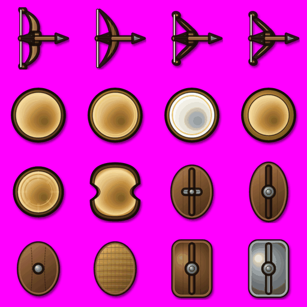

| Cell | Row, col | Pixel box (x, y) | ID | Meaning in the game | Shape to draw |
| --- | --- | --- | --- | --- | --- |
| 1 | R1 C1 | 0-255, 0-255 | `item:persian_bow` | Weapon, tier 2: **Persian bow**. Long-eared composite bow of the Great King. Shoots arrows in clouds. | a long-eared Persian composite bow standing upright, stiff angled tips, red-painted grip, an arrow nocked |
| 2 | R1 C2 | 256-511, 0-255 | `item:self_bow` | Weapon, tier 1: **Hunting bow**. A plain wooden bow. Two-handed; weaker than a composite. | a plain simple wooden D-shaped bow standing upright, with its string, no arrow |
| 3 | R1 C3 | 512-767, 0-255 | `item:scythian_bow` | Weapon, tier 2: **Scythian bow**. Short recurve bow, quick to draw from the saddle. | a short double-curved Scythian bow standing upright, an arrow nocked |
| 4 | R1 C4 | 768-1023, 0-255 | `item:gorytos_bow` | Weapon, tier 3: **Gorytos bow**. A royal steppe bow in a gilded bow-case. Fast, deep quiver. | a short steppe bow tucked into a gilded leather bow-case (gorytos) with arrow fletchings showing |
| 5 | R2 C1 | 0-255, 256-511 | `item:hoplon` | Shield, tier 1: **Hoplon**. Great round bronze-faced shield. Enables the shield wall. | a round domed hoplite shield, plain bronze face, wide flat rim |
| 6 | R2 C2 | 256-511, 256-511 | `item:aspis` | Shield, tier 3: **Argive aspis**. A masterwork hoplon, passed father to son. | a round aspis with an engraved bronze rim and a red face with a white star emblem |
| 7 | R2 C3 | 512-767, 256-511 | `item:argyraspis` | Shield, tier 3: **Silver aspis**. Silver-faced aspis of the royal guard. | a round aspis faced in gleaming silver, a small gold sunburst at the centre |
| 8 | R2 C4 | 768-1023, 256-511 | `item:spartan_aspis` | Shield, tier 3: **Lakedaimonian aspis**. Come back with it or on it. | a round bronze-rimmed aspis with a red face and a large white lambda (an upside-down V) |
| 9 | R3 C1 | 0-255, 512-767 | `item:macedonian_aspis` | Shield, tier 2: **Macedonian aspis**. Smaller, flatter aspis on a neck strap: it leaves both hands for the pike. | a smaller, flatter round bronze shield with an embossed eight-ray sun |
| 10 | R3 C2 | 256-511, 512-767 | `item:boeotian_shield` | Shield, tier 2: **Boeotian shield**. Hoplon with cut-away sides for a spear to pass. The Theban pattern. | an oval bronze hoplite shield with two semicircular notches cut out of its sides |
| 11 | R3 C3 | 512-767, 512-767 | `item:thureos` | Shield, tier 1: **Thureos**. Light oval shield with an iron boss. | a light oval wooden shield, white face, a vertical spine and a strip iron boss |
| 12 | R3 C4 | 768-1023, 512-767 | `item:celtic_shield` | Shield, tier 2: **Celtic long shield**. Tall plank shield with a spina. | a tall narrow plank shield with rounded ends, painted green, a long vertical spine and a round boss |
| 13 | R4 C1 | 0-255, 768-1023 | `item:hide_shield` | Shield, tier 1: **Hide shield**. Ox-hide stretched on a frame. Light; it still locks in a wall. | an oval shield of spotted brown-and-white ox hide stretched on a wooden frame |
| 14 | R4 C2 | 256-511, 768-1023 | `item:gerron` | Shield, tier 1: **Gerron**. Tall Persian wicker shield. Stops arrows; heavy to carry. | a tall rectangular Persian shield of woven tan reeds with a leather border |
| 15 | R4 C3 | 512-767, 768-1023 | `item:scutum` | Shield, tier 2: **Scutum**. Big curved Italian shield of glued planks and hide. | a big curved oval Italian shield of reddish wood planks, a vertical spine and a wooden boss |
| 16 | R4 C4 | 768-1023, 768-1023 | `item:legion_scutum` | Shield, tier 3: **Legionary scutum**. Iron-rimmed scutum with a heavy boss. A wall on its own. | a big curved rectangular red Roman scutum with an iron rim and a central iron boss |

Sheet prompt:

```text
Sheet 10 of 15: weapons and shields.
Weapons are drawn diagonally across the cell: grip / butt at the lower left, tip / blade at the
upper right, at the same 45 degree angle (bows stand upright, slings hang). Shields, helmets and armour are front views, upright.
Trinkets are small jewellery objects; when hanging from a cord, the cord's two ends go up to the
top of the icon area.
Items of one family (several spears, several helmets...) must be clearly different from each
other at a glance: follow each cell's shape, material and colour exactly.
Cells, in reading order:
1. (row 1, column 1) A long-eared Persian composite bow standing upright, stiff angled tips, red-painted grip, an arrow nocked.
2. (row 1, column 2) A plain simple wooden D-shaped bow standing upright, with its string, no arrow.
3. (row 1, column 3) A short double-curved Scythian bow standing upright, an arrow nocked.
4. (row 1, column 4) A short steppe bow tucked into a gilded leather bow-case (gorytos) with arrow fletchings showing.
5. (row 2, column 1) A round domed hoplite shield, plain bronze face, wide flat rim.
6. (row 2, column 2) A round aspis with an engraved bronze rim and a red face with a white star emblem.
7. (row 2, column 3) A round aspis faced in gleaming silver, a small gold sunburst at the centre.
8. (row 2, column 4) A round bronze-rimmed aspis with a red face and a large white lambda (an upside-down V).
9. (row 3, column 1) A smaller, flatter round bronze shield with an embossed eight-ray sun.
10. (row 3, column 2) An oval bronze hoplite shield with two semicircular notches cut out of its sides.
11. (row 3, column 3) A light oval wooden shield, white face, a vertical spine and a strip iron boss.
12. (row 3, column 4) A tall narrow plank shield with rounded ends, painted green, a long vertical spine and a round boss.
13. (row 4, column 1) An oval shield of spotted brown-and-white ox hide stretched on a wooden frame.
14. (row 4, column 2) A tall rectangular Persian shield of woven tan reeds with a leather border.
15. (row 4, column 3) A big curved oval Italian shield of reddish wood planks, a vertical spine and a wooden boss.
16. (row 4, column 4) A big curved rectangular red Roman scutum with an iron rim and a central iron boss.
```

## Sheet 11: Shields and helmets

File: `sheet-11.png`. Current icons in the same cells: [current/sheet-11.png](current/sheet-11.png)

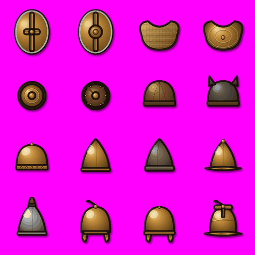

| Cell | Row, col | Pixel box (x, y) | ID | Meaning in the game | Shape to draw |
| --- | --- | --- | --- | --- | --- |
| 1 | R1 C1 | 0-255, 0-255 | `item:punic_shield` | Shield, tier 2: **Punic oval shield**. Bronze-faced oval of the Libyan spearmen, painted with the sign of Tanit. | a bronze-faced oval shield painted with the dark red sign of Tanit (triangle, bar and disc) |
| 2 | R1 C2 | 256-511, 0-255 | `item:bossed_shield` | Shield, tier 3: **Bronze-bossed shield**. A chieftain's long shield, its boss worked in swirling bronze. | a tall Celtic long shield with a large bronze boss worked in swirling spirals |
| 3 | R1 C3 | 512-767, 0-255 | `item:pelte` | Shield, tier 1: **Pelte**. Crescent wicker shield of the Thracian peltast. No shield wall. | a crescent-shaped wicker shield covered in tan leather |
| 4 | R1 C4 | 768-1023, 0-255 | `item:bronze_pelte` | Shield, tier 2: **Bronze-faced pelte**. A pelte sheathed in thin bronze. No shield wall. | a crescent-shaped pelte sheathed in thin bronze, a ring of small rivets |
| 5 | R2 C1 | 0-255, 256-511 | `item:buckler` | Shield, tier 1: **Buckler**. Small hand shield. No shield wall. | a small round bronze shield with concentric rings and a central boss |
| 6 | R2 C2 | 256-511, 256-511 | `item:caetra` | Shield, tier 2: **Caetra**. Small round Iberian shield, made for parrying. No shield wall. | a small round Iberian leather shield with a ring of bronze studs and a central boss |
| 7 | R2 C3 | 512-767, 256-511 | `item:cap` | Helmet, tier 1: **Leather cap**. Better than nothing. | a simple brown leather skullcap of stitched segments |
| 8 | R2 C4 | 768-1023, 256-511 | `item:wolfskin_cap` | Helmet, tier 1: **Wolfskin cap**. A wolf's mask worn over the brow. | a grey wolf's head pelt worn as a cap, the wolf's snout and ears over the brow |
| 9 | R3 C1 | 0-255, 512-767 | `item:bronze_skullcap` | Helmet, tier 1: **Bronze skullcap**. A plain hammered bowl. | a plain round hammered bronze bowl helmet with no fittings |
| 10 | R3 C2 | 256-511, 512-767 | `item:pilos` | Helmet, tier 1: **Pilos helmet**. Conical bronze helmet. | a conical bronze pilos helmet with a narrow rim |
| 11 | R3 C3 | 512-767, 512-767 | `item:felt_pilos` | Helmet, tier 1: **Felt pilos**. The traveller's felt cap. Cool and light. | a soft conical brown felt cap |
| 12 | R3 C4 | 768-1023, 512-767 | `item:konos` | Helmet, tier 1: **Konos helmet**. Bronze cone with a narrow brim. | a tall bronze cone helmet with a narrow brim and a small knob on the tip |
| 13 | R4 C1 | 0-255, 768-1023 | `item:iron_pilos` | Helmet, tier 2: **Iron pilos**. Late pilos in iron: tough and open-faced. | a conical dark iron pilos helmet with hinged cheek guards |
| 14 | R4 C2 | 256-511, 768-1023 | `item:montefortino` | Helmet, tier 2: **Montefortino**. Knobbed bowl helmet with cheek guards. | a Montefortino helmet: rounded bronze bowl, top knob, short neck flare, cheek guards |
| 15 | R4 C3 | 512-767, 768-1023 | `item:coolus` | Helmet, tier 2: **Coolus helm**. Round Gallic bowl with a little neck guard. | a round Gallic bronze bowl helmet with a small flat neck guard |
| 16 | R4 C4 | 768-1023, 768-1023 | `item:negau` | Helmet, tier 2: **Negau helm**. Ridged Alpine helm of the Etruscans. Low brim, deep bowl. | an Etruscan Negau helmet: deep bronze bowl with a raised ridge over the top and a low flat brim |

Sheet prompt:

```text
Sheet 11 of 15: shields and helmets.
Weapons are drawn diagonally across the cell: grip / butt at the lower left, tip / blade at the
upper right, at the same 45 degree angle (bows stand upright, slings hang). Shields, helmets and armour are front views, upright.
Trinkets are small jewellery objects; when hanging from a cord, the cord's two ends go up to the
top of the icon area.
Items of one family (several spears, several helmets...) must be clearly different from each
other at a glance: follow each cell's shape, material and colour exactly.
Cells, in reading order:
1. (row 1, column 1) A bronze-faced oval shield painted with the dark red sign of Tanit (triangle, bar and disc).
2. (row 1, column 2) A tall Celtic long shield with a large bronze boss worked in swirling spirals.
3. (row 1, column 3) A crescent-shaped wicker shield covered in tan leather.
4. (row 1, column 4) A crescent-shaped pelte sheathed in thin bronze, a ring of small rivets.
5. (row 2, column 1) A small round bronze shield with concentric rings and a central boss.
6. (row 2, column 2) A small round Iberian leather shield with a ring of bronze studs and a central boss.
7. (row 2, column 3) A simple brown leather skullcap of stitched segments.
8. (row 2, column 4) A grey wolf's head pelt worn as a cap, the wolf's snout and ears over the brow.
9. (row 3, column 1) A plain round hammered bronze bowl helmet with no fittings.
10. (row 3, column 2) A conical bronze pilos helmet with a narrow rim.
11. (row 3, column 3) A soft conical brown felt cap.
12. (row 3, column 4) A tall bronze cone helmet with a narrow brim and a small knob on the tip.
13. (row 4, column 1) A conical dark iron pilos helmet with hinged cheek guards.
14. (row 4, column 2) A Montefortino helmet: rounded bronze bowl, top knob, short neck flare, cheek guards.
15. (row 4, column 3) A round Gallic bronze bowl helmet with a small flat neck guard.
16. (row 4, column 4) An Etruscan Negau helmet: deep bronze bowl with a raised ridge over the top and a low flat brim.
```

## Sheet 12: Helmets and armour

File: `sheet-12.png`. Current icons in the same cells: [current/sheet-12.png](current/sheet-12.png)

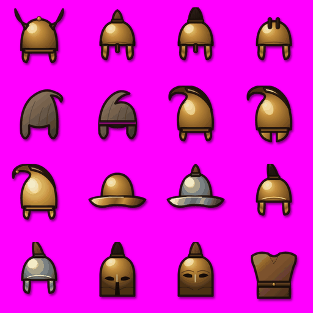

| Cell | Row, col | Pixel box (x, y) | ID | Meaning in the game | Shape to draw |
| --- | --- | --- | --- | --- | --- |
| 1 | R1 C1 | 0-255, 0-255 | `item:horned_helm` | Helmet, tier 3: **Horned helm**. Ceremonial bronze cap with two horns. More awe than armour. | a ceremonial bronze cap helmet with two big curving horns |
| 2 | R1 C2 | 256-511, 0-255 | `item:chalcidian` | Helmet, tier 2: **Chalcidian helm**. Crested helm with open ears. | a Chalcidian bronze helmet: open face, cheek guards, ear openings, a small red crest |
| 3 | R1 C3 | 512-767, 0-255 | `item:crested_chalcidian` | Helmet, tier 3: **Plumed Chalcidian helm**. Silver-browed Chalcidian with a tall horsehair crest. | a Chalcidian helmet with silver eyebrows and a tall red-and-white horsehair crest |
| 4 | R1 C4 | 768-1023, 0-255 | `item:illyrian` | Helmet, tier 2: **Illyrian helm**. Square-faced helm with a crest channel. Snug and solid. | an Illyrian bronze helmet: square open face, two raised ridges along the top forming a crest channel |
| 5 | R2 C1 | 0-255, 256-511 | `item:scythian_hood` | Helmet, tier 1: **Felt hood**. Pointed felt hood of the steppe riders. | a pointed brown felt Scythian hood with long side flaps |
| 6 | R2 C2 | 256-511, 256-511 | `item:persian_tiara` | Helmet, tier 1: **Persian tiara**. Soft felt hood with lappets tied under the chin. | a soft cream felt Persian hood, top flopping forward, lappets tied under the chin |
| 7 | R2 C3 | 512-767, 256-511 | `item:thracian` | Helmet, tier 2: **Thracian helm**. Peaked bronze cap with a forward crest. | a Thracian bronze helmet with a forward-curving crest, a short brim and cheek guards |
| 8 | R2 C4 | 768-1023, 256-511 | `item:phrygian` | Helmet, tier 2: **Phrygian helm**. Tall forward-curling crown and cheek pieces. | a Phrygian helmet: a tall bronze crown curling far forward, cheek pieces |
| 9 | R3 C1 | 0-255, 512-767 | `item:gilded_thracian` | Helmet, tier 3: **Gilded Thracian helm**. A prince's helm with gilded eyebrows and beard on the cheeks. | a Thracian helmet with gold eyebrows and a gold beard embossed on the cheek guards |
| 10 | R3 C2 | 256-511, 512-767 | `item:boeotian` | Helmet, tier 2: **Boeotian helm**. Open cavalry helm with a folded brim: a clear view. | a Boeotian bronze cavalry helmet with a wide, folded, downturned brim |
| 11 | R3 C3 | 512-767, 512-767 | `item:iron_boeotian` | Helmet, tier 3: **Iron Boeotian helm**. Xenophon's choice for a horseman, in iron. | a Boeotian cavalry helmet in dark iron with a folded brim |
| 12 | R3 C4 | 768-1023, 512-767 | `item:attic` | Helmet, tier 3: **Attic helm**. Plumed parade helm of the royal guard. | an Attic helmet: rounded bronze bowl, brow ridge, hinged cheek guards, a tall plume |
| 13 | R4 C1 | 0-255, 768-1023 | `item:hellenistic` | Helmet, tier 3: **Hellenistic helm**. The Successors' practical helm: brow peak, hinged cheeks, good view. | a Hellenistic iron helmet with a projecting brow peak and hinged cheek guards, no crest |
| 14 | R4 C2 | 256-511, 768-1023 | `item:corinthian` | Helmet, tier 3: **Corinthian helm**. Full-face bronze. Terrifying, but hard to see out of. | a Corinthian helmet, front view: a full bronze face cover with almond eye openings, a nose guard and a crest stub |
| 15 | R4 C3 | 512-767, 768-1023 | `item:apulo_corinthian` | Helmet, tier 2: **Apulo-Corinthian helm**. A Corinthian worn pushed up like a cap: the look without the blindness. | an Apulo-Corinthian helmet: a closed bronze bowl with decorative engraved eyes and nose on the front, no real face opening, a small crest |
| 16 | R4 C4 | 768-1023, 768-1023 | `item:leather` | Armour, tier 1: **Leather jerkin**. Boiled leather over the tunic. | a brown boiled-leather jerkin, front view, with a belt |

Sheet prompt:

```text
Sheet 12 of 15: helmets and armour.
Weapons are drawn diagonally across the cell: grip / butt at the lower left, tip / blade at the
upper right, at the same 45 degree angle (bows stand upright, slings hang). Shields, helmets and armour are front views, upright.
Trinkets are small jewellery objects; when hanging from a cord, the cord's two ends go up to the
top of the icon area.
Items of one family (several spears, several helmets...) must be clearly different from each
other at a glance: follow each cell's shape, material and colour exactly.
Cells, in reading order:
1. (row 1, column 1) A ceremonial bronze cap helmet with two big curving horns.
2. (row 1, column 2) A Chalcidian bronze helmet: open face, cheek guards, ear openings, a small red crest.
3. (row 1, column 3) A Chalcidian helmet with silver eyebrows and a tall red-and-white horsehair crest.
4. (row 1, column 4) An Illyrian bronze helmet: square open face, two raised ridges along the top forming a crest channel.
5. (row 2, column 1) A pointed brown felt Scythian hood with long side flaps.
6. (row 2, column 2) A soft cream felt Persian hood, top flopping forward, lappets tied under the chin.
7. (row 2, column 3) A Thracian bronze helmet with a forward-curving crest, a short brim and cheek guards.
8. (row 2, column 4) A Phrygian helmet: a tall bronze crown curling far forward, cheek pieces.
9. (row 3, column 1) A Thracian helmet with gold eyebrows and a gold beard embossed on the cheek guards.
10. (row 3, column 2) A Boeotian bronze cavalry helmet with a wide, folded, downturned brim.
11. (row 3, column 3) A Boeotian cavalry helmet in dark iron with a folded brim.
12. (row 3, column 4) An Attic helmet: rounded bronze bowl, brow ridge, hinged cheek guards, a tall plume.
13. (row 4, column 1) A Hellenistic iron helmet with a projecting brow peak and hinged cheek guards, no crest.
14. (row 4, column 2) A Corinthian helmet, front view: a full bronze face cover with almond eye openings, a nose guard and a crest stub.
15. (row 4, column 3) An Apulo-Corinthian helmet: a closed bronze bowl with decorative engraved eyes and nose on the front, no real face opening, a small crest.
16. (row 4, column 4) A brown boiled-leather jerkin, front view, with a belt.
```

## Sheet 13: Armour

File: `sheet-13.png`. Current icons in the same cells: [current/sheet-13.png](current/sheet-13.png)

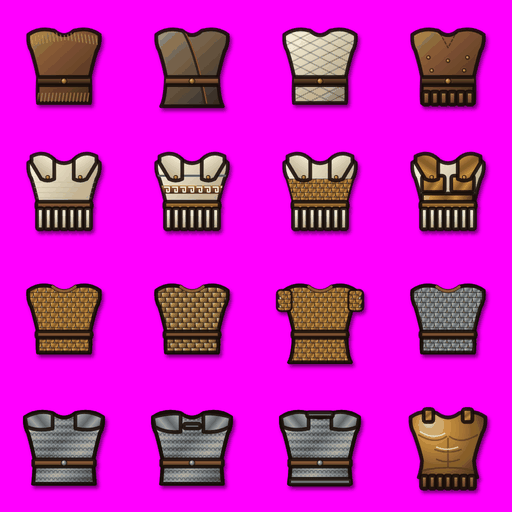

| Cell | Row, col | Pixel box (x, y) | ID | Meaning in the game | Shape to draw |
| --- | --- | --- | --- | --- | --- |
| 1 | R1 C1 | 0-255, 0-255 | `item:hide_jerkin` | Armour, tier 1: **Hide jerkin**. Untanned furs of beasts the wearer killed himself. | a shaggy jerkin of brown and grey fur pelts, front view |
| 2 | R1 C2 | 256-511, 0-255 | `item:felt_coat` | Armour, tier 1: **Felt kaftan**. Thick felt coat of the steppe. Warm, light, soaks up a cut. | a long thick red felt steppe kaftan with a cream border, wrap-over front |
| 3 | R1 C3 | 512-767, 0-255 | `item:quilted` | Armour, tier 1: **Quilted tunic**. Layers of stitched linen and wool stuffing. | a padded cream quilted tunic with diamond stitching |
| 4 | R1 C4 | 768-1023, 0-255 | `item:spolas` | Armour, tier 1: **Spolas**. Leather corselet with shoulder flaps, as Xenophon's men wore. | a leather corselet with shoulder flaps and one row of leather strips at the bottom |
| 5 | R2 C1 | 0-255, 256-511 | `item:linothorax` | Armour, tier 1: **Linothorax**. Layered linen, light and stiff. | a white layered linen cuirass, shoulder flaps, a skirt of strips |
| 6 | R2 C2 | 256-511, 256-511 | `item:painted_linothorax` | Armour, tier 2: **Painted linothorax**. Glued linen in bright meander borders. Proud and light. | a white linen cuirass painted with red-and-black meander borders |
| 7 | R2 C3 | 512-767, 256-511 | `item:scaled_linothorax` | Armour, tier 2: **Scaled linothorax**. Linen with bronze scales over the belly. | a white linen cuirass with a panel of bronze scales over the belly |
| 8 | R2 C4 | 768-1023, 256-511 | `item:plated_linothorax` | Armour, tier 3: **Plated linothorax**. Linen faced with bronze plates and scales. Most of a cuirass for less weight. | a linen cuirass faced with bronze plates on the chest and bronze scales on the belly |
| 9 | R3 C1 | 0-255, 512-767 | `item:scale` | Armour, tier 2: **Scale corselet**. Bronze scales on a linen backing. | a scale corselet of overlapping bronze scales on linen |
| 10 | R3 C2 | 256-511, 512-767 | `item:horn_scale` | Armour, tier 2: **Horn scale**. Sarmatian scales cut from horse hooves. Light for scale. | a laced shirt of pale cream-and-grey horn scales |
| 11 | R3 C3 | 512-767, 512-767 | `item:persian_scale` | Armour, tier 2: **Persian scale coat**. Long-sleeved coat of small bronze scales. Heavy. | a long-sleeved coat of small bronze scales reaching the knees |
| 12 | R3 C4 | 768-1023, 512-767 | `item:iron_scale` | Armour, tier 3: **Iron scale**. Iron scales on leather: proof against arrows. | a shirt of dark iron scales on leather |
| 13 | R4 C1 | 0-255, 768-1023 | `item:mail` | Armour, tier 3: **Ring mail**. A Celtic invention: iron rings. | an iron mail shirt with short sleeves and a belt |
| 14 | R4 C2 | 256-511, 768-1023 | `item:hamata` | Armour, tier 3: **Lorica hamata**. Italian mail shirt with doubled shoulders. Lighter than Gallic mail. | a Roman mail shirt with doubled shoulder capes held by bronze hooks |
| 15 | R4 C3 | 512-767, 768-1023 | `item:noble_mail` | Armour, tier 3: **Noble's mail**. Fine riveted rings with a bronze-hooked cape. A chieftain's fortune. | a fine iron mail shirt with a cape over the shoulders fastened by gold S-hooks |
| 16 | R4 C4 | 768-1023, 768-1023 | `item:cuirass` | Armour, tier 3: **Muscle cuirass**. Sculpted bronze. The look of a hero. | a bronze muscle cuirass, sculpted chest and abdomen, strips hanging below |

Sheet prompt:

```text
Sheet 13 of 15: armour.
Weapons are drawn diagonally across the cell: grip / butt at the lower left, tip / blade at the
upper right, at the same 45 degree angle (bows stand upright, slings hang). Shields, helmets and armour are front views, upright.
Trinkets are small jewellery objects; when hanging from a cord, the cord's two ends go up to the
top of the icon area.
Items of one family (several spears, several helmets...) must be clearly different from each
other at a glance: follow each cell's shape, material and colour exactly.
Cells, in reading order:
1. (row 1, column 1) A shaggy jerkin of brown and grey fur pelts, front view.
2. (row 1, column 2) A long thick red felt steppe kaftan with a cream border, wrap-over front.
3. (row 1, column 3) A padded cream quilted tunic with diamond stitching.
4. (row 1, column 4) A leather corselet with shoulder flaps and one row of leather strips at the bottom.
5. (row 2, column 1) A white layered linen cuirass, shoulder flaps, a skirt of strips.
6. (row 2, column 2) A white linen cuirass painted with red-and-black meander borders.
7. (row 2, column 3) A white linen cuirass with a panel of bronze scales over the belly.
8. (row 2, column 4) A linen cuirass faced with bronze plates on the chest and bronze scales on the belly.
9. (row 3, column 1) A scale corselet of overlapping bronze scales on linen.
10. (row 3, column 2) A laced shirt of pale cream-and-grey horn scales.
11. (row 3, column 3) A long-sleeved coat of small bronze scales reaching the knees.
12. (row 3, column 4) A shirt of dark iron scales on leather.
13. (row 4, column 1) An iron mail shirt with short sleeves and a belt.
14. (row 4, column 2) A Roman mail shirt with doubled shoulder capes held by bronze hooks.
15. (row 4, column 3) A fine iron mail shirt with a cape over the shoulders fastened by gold S-hooks.
16. (row 4, column 4) A bronze muscle cuirass, sculpted chest and abdomen, strips hanging below.
```

## Sheet 14: Armour and trinkets

File: `sheet-14.png`. Current icons in the same cells: [current/sheet-14.png](current/sheet-14.png)

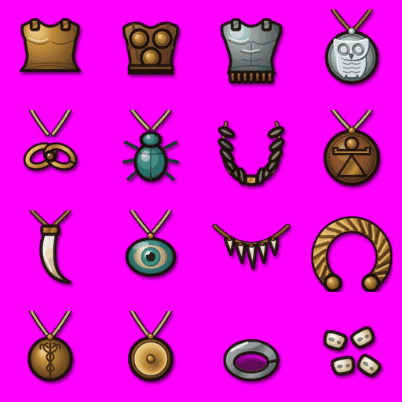

| Cell | Row, col | Pixel box (x, y) | ID | Meaning in the game | Shape to draw |
| --- | --- | --- | --- | --- | --- |
| 1 | R1 C1 | 0-255, 0-255 | `item:bell_cuirass` | Armour, tier 2: **Bell cuirass**. Old-fashioned bronze bell, flared at the hips. Grandfather's armour. | an archaic bronze bell cuirass flaring out at the hips, spiral marks on the chest |
| 2 | R1 C2 | 256-511, 0-255 | `item:triple_disc` | Armour, tier 2: **Triple-disc cuirass**. Three bronze discs front and back: Samnite pride. | a Samnite cuirass: three round bronze discs on the chest joined by straps |
| 3 | R1 C3 | 512-767, 0-255 | `item:iron_cuirass` | Armour, tier 3: **Iron cuirass**. A king's iron cuirass, gold-trimmed. The heaviest there is. | a dark iron muscle cuirass with gold trim |
| 4 | R1 C4 | 768-1023, 0-255 | `trinket:owl_amulet` | Trinket, tier 1: **Owl amulet**. Athena watches. +morale. | a round silver amulet with an owl of Athena in relief, on a cord |
| 5 | R2 C1 | 0-255, 256-511 | `trinket:herakles_knot` | Trinket, tier 1: **Herakles knot**. Gold knot charm. +HP. | a gold Herakles knot (two interlocked loops) with a red garnet in the centre |
| 6 | R2 C2 | 256-511, 256-511 | `trinket:scarab` | Trinket, tier 1: **Faience scarab**. Phoenician luck. +stamina. | a turquoise faience scarab beetle, top view |
| 7 | R2 C3 | 512-767, 256-511 | `trinket:laurel` | Trinket, tier 2: **Laurel token**. Learns faster. +30% XP. | a small green laurel wreath, almost a closed circle, on a cord |
| 8 | R2 C4 | 768-1023, 256-511 | `trinket:tanit_eye` | Trinket, tier 2: **Eye of Tanit**. +accuracy, +block. | a round terracotta pendant with the bronze sign of Tanit (a triangle, a bar and a disc), on a cord |
| 9 | R3 C1 | 0-255, 512-767 | `trinket:boar_tusk` | Trinket, tier 2: **Boar tusk**. +melee damage. | a curved white boar tusk hanging from a cord |
| 10 | R3 C2 | 256-511, 512-767 | `trinket:eye_bead` | Trinket, tier 1: **Eye bead**. Blue glass eye against the evil eye. +accuracy. | a blue and white glass eye bead (nazar) on a cord |
| 11 | R3 C3 | 512-767, 512-767 | `trinket:wolf_tooth` | Trinket, tier 1: **Wolf-tooth string**. The wolf lends his legs. +speed, +morale. | a necklace arc of pointed wolf teeth on a cord |
| 12 | R3 C4 | 768-1023, 512-767 | `trinket:torc` | Trinket, tier 1: **Bronze torc**. Twisted neck-ring of a free warrior. +morale, +HP. | a twisted bronze Celtic torc, an open ring with knob ends at the bottom |
| 13 | R4 C1 | 0-255, 768-1023 | `trinket:hermes_token` | Trinket, tier 1: **Hermes token**. Winged sandal of the messenger. +speed, but you tire sooner. | a round bronze pendant with a winged sandal in relief, on a cord |
| 14 | R4 C2 | 256-511, 768-1023 | `trinket:votive_shield` | Trinket, tier 1: **Votive shield**. A tiny shield vowed at a shrine. +block. | a tiny round gold votive shield pendant on a cord |
| 15 | R4 C3 | 512-767, 768-1023 | `trinket:iron_ring` | Trinket, tier 1: **Iron ring**. Plain iron, as the Spartans wore. +armour, +HP. | a plain thick iron ring, 3/4 view |
| 16 | R4 C4 | 768-1023, 768-1023 | `trinket:knucklebones` | Trinket, tier 1: **Knucklebones**. Astragali for games by the fire. +15% XP. | four small ivory knucklebones (astragali) scattered |

Sheet prompt:

```text
Sheet 14 of 15: armour and trinkets.
Weapons are drawn diagonally across the cell: grip / butt at the lower left, tip / blade at the
upper right, at the same 45 degree angle (bows stand upright, slings hang). Shields, helmets and armour are front views, upright.
Trinkets are small jewellery objects; when hanging from a cord, the cord's two ends go up to the
top of the icon area.
Items of one family (several spears, several helmets...) must be clearly different from each
other at a glance: follow each cell's shape, material and colour exactly.
Cells, in reading order:
1. (row 1, column 1) An archaic bronze bell cuirass flaring out at the hips, spiral marks on the chest.
2. (row 1, column 2) A Samnite cuirass: three round bronze discs on the chest joined by straps.
3. (row 1, column 3) A dark iron muscle cuirass with gold trim.
4. (row 1, column 4) A round silver amulet with an owl of Athena in relief, on a cord.
5. (row 2, column 1) A gold Herakles knot (two interlocked loops) with a red garnet in the centre.
6. (row 2, column 2) A turquoise faience scarab beetle, top view.
7. (row 2, column 3) A small green laurel wreath, almost a closed circle, on a cord.
8. (row 2, column 4) A round terracotta pendant with the bronze sign of Tanit (a triangle, a bar and a disc), on a cord.
9. (row 3, column 1) A curved white boar tusk hanging from a cord.
10. (row 3, column 2) A blue and white glass eye bead (nazar) on a cord.
11. (row 3, column 3) A necklace arc of pointed wolf teeth on a cord.
12. (row 3, column 4) A twisted bronze Celtic torc, an open ring with knob ends at the bottom.
13. (row 4, column 1) A round bronze pendant with a winged sandal in relief, on a cord.
14. (row 4, column 2) A tiny round gold votive shield pendant on a cord.
15. (row 4, column 3) A plain thick iron ring, 3/4 view.
16. (row 4, column 4) Four small ivory knucklebones (astragali) scattered.
```

## Sheet 15: Trinkets

File: `sheet-15.png`. Current icons in the same cells: [current/sheet-15.png](current/sheet-15.png)

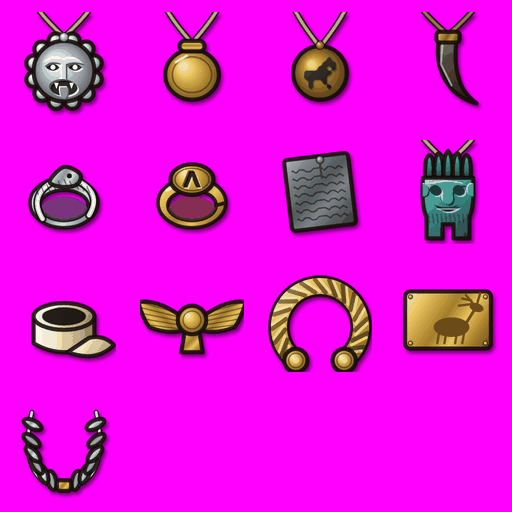

| Cell | Row, col | Pixel box (x, y) | ID | Meaning in the game | Shape to draw |
| --- | --- | --- | --- | --- | --- |
| 1 | R1 C1 | 0-255, 0-255 | `trinket:gorgoneion` | Trinket, tier 2: **Gorgoneion**. Medusa's face turns the enemy's heart to stone. +morale shock. | a silver medallion of Medusa's face with snake hair, tongue out |
| 2 | R1 C2 | 256-511, 0-255 | `trinket:bulla` | Trinket, tier 2: **Golden bulla**. Etruscan locket worn since boyhood. +HP, +morale. | a round lens-shaped gold locket (bulla) on a cord |
| 3 | R1 C3 | 512-767, 0-255 | `trinket:horse_pendant` | Trinket, tier 2: **Horse pendant**. Poseidon Hippios gives the charge its weight. +charge. | a round bronze pendant with a dark horse silhouette, on a cord |
| 4 | R1 C4 | 768-1023, 0-255 | `trinket:lion_claw` | Trinket, tier 2: **Lion claw**. From a lion of the Macedonian hills. +damage, +morale shock. | a dark curved lion claw hanging from a cord |
| 5 | R2 C1 | 0-255, 256-511 | `trinket:serpent_ring` | Trinket, tier 2: **Serpent ring**. Coiled silver snake of Asklepios. +HP, +stamina. | a silver ring shaped as a coiled snake, its head on top |
| 6 | R2 C2 | 256-511, 256-511 | `trinket:signet_ring` | Trinket, tier 2: **Signet ring**. A gold seal: the mark of a man who gives orders. +XP, +morale. | a gold signet ring with an engraved oval bezel |
| 7 | R2 C3 | 512-767, 256-511 | `trinket:curse_tablet` | Trinket, tier 2: **Curse tablet**. Names of foes scratched and nailed down. +shield-break, but it weighs on you. | a small grey lead tablet with scratched lines of writing, slightly tilted |
| 8 | R2 C4 | 768-1023, 256-511 | `trinket:bes_amulet` | Trinket, tier 2: **Bes amulet**. The grinning dwarf god scares off ill luck. +morale, +stamina. | a turquoise faience amulet of Bes, the squat Egyptian god with a feather crown |
| 9 | R3 C1 | 0-255, 512-767 | `trinket:thumb_ring` | Trinket, tier 2: **Archer's thumb ring**. Draws the string clean. +accuracy, but clumsy behind a shield. | a cream bone archer's thumb ring, a short wide cylinder with a lip |
| 10 | R3 C2 | 256-511, 512-767 | `trinket:faravahar` | Trinket, tier 2: **Winged disc**. Persian winged sun in gold. +morale, +accuracy. | a gold winged sun disc with spread wings |
| 11 | R3 C3 | 512-767, 512-767 | `trinket:gold_torc` | Trinket, tier 3: **Gold torc**. Heavy gold neck-ring of a king among Celts. +morale, +HP. | a thick twisted gold torc, an open ring with round gold ends at the bottom |
| 12 | R3 C4 | 768-1023, 512-767 | `trinket:gold_stag` | Trinket, tier 3: **Gold stag plaque**. Shield badge of a steppe lord: a stag with folded legs. +charge, +morale, +HP. | a rectangular gold plaque with an embossed stag |
| 13 | R4 C1 | 0-255, 768-1023 | `trinket:pythian_token` | Trinket, tier 3: **Pythian crown**. Laurel from Delphi, given to a victor of the games. +35% XP, +morale. | a victor's crown of dark green bay leaves bound with silver |

Sheet prompt:

```text
Sheet 15 of 15: trinkets.
Weapons are drawn diagonally across the cell: grip / butt at the lower left, tip / blade at the
upper right, at the same 45 degree angle (bows stand upright, slings hang). Shields, helmets and armour are front views, upright.
Trinkets are small jewellery objects; when hanging from a cord, the cord's two ends go up to the
top of the icon area.
Items of one family (several spears, several helmets...) must be clearly different from each
other at a glance: follow each cell's shape, material and colour exactly.
Cells, in reading order:
1. (row 1, column 1) A silver medallion of Medusa's face with snake hair, tongue out.
2. (row 1, column 2) A round lens-shaped gold locket (bulla) on a cord.
3. (row 1, column 3) A round bronze pendant with a dark horse silhouette, on a cord.
4. (row 1, column 4) A dark curved lion claw hanging from a cord.
5. (row 2, column 1) A silver ring shaped as a coiled snake, its head on top.
6. (row 2, column 2) A gold signet ring with an engraved oval bezel.
7. (row 2, column 3) A small grey lead tablet with scratched lines of writing, slightly tilted.
8. (row 2, column 4) A turquoise faience amulet of Bes, the squat Egyptian god with a feather crown.
9. (row 3, column 1) A cream bone archer's thumb ring, a short wide cylinder with a lip.
10. (row 3, column 2) A gold winged sun disc with spread wings.
11. (row 3, column 3) A thick twisted gold torc, an open ring with round gold ends at the bottom.
12. (row 3, column 4) A rectangular gold plaque with an embossed stag.
13. (row 4, column 1) A victor's crown of dark green bay leaves bound with silver.
Cells 14 to 16: leave empty (plain magenta).
```

## Single-icon prompt

For re-rolling one icon that came out wrong. Paste the global prompt's
**Art style** part, then:

```text
Create ONE square image, 1024 x 1024 pixels, flat pure magenta #FF00FF background, with a single
game icon centred in it, filling the central 832 x 832 pixels and touching no edge. No text,
no frame, no shadow on the background.
The icon: <shape to draw, from the sheet table>.
It must match the other icons of the set: same outline, lighting and level of detail.
```

## ID reference

| Prefix | Comes from | Notes |
| --- | --- | --- |
| `ui:` | `VECTOR_ICONS` / `UI_ICONS`, texture keys `icon_<name>`, `iconL_<name>`, `iconD_<name>` | battle FX also reuses these (`fxicon_*`) |
| `camp:` | `VECTOR_CAMP_ICONS`, texture keys `icon_camp_<name>` | |
| `chrome:` | `src/ui/online.ts`, texture keys `sync_*`, `supporter_banner` | not square: draw the cloud wide and the banner tall inside the cell |
| `goods:` | `src/art/goodsIcons.ts` (`renderGoodsIconHD`) | resources and battle consumables |
| `item:` | `src/data/items.ts` item ID (today drawn by `src/art/itemIconsHD.ts` from the item's `art` key) | one picture per item; rarity frames, glow and sparkles stay in code |
| `trinket:` | `src/data/items.ts` item ID (`slot: 'trinket'`) | |

Rules that still hold for the new art (docs/UI_KIT.md "One icon, one meaning"):
the resource icons `ui:coin`, `ui:laurel`, `ui:drachma`, `ui:tgstar`,
`ui:power`, `ui:trophy` and `ui:xp` must not look alike; `ui:star`,
`ui:podium`, `ui:lock` and `ui:shop` are reserved for their one meaning;
`ui:tgstar` must never look like the gold rating star `ui:star`.

## Not in the atlas

Not icons, or drawn by other pipelines, so not part of this replacement:
unit and hero sprites and portraits (`paperdoll.ts`), cosmetic previews
(`cosmeticArt.ts`), shield emblems (`emblems.ts`), beasts, map, camp and
terrain art, battle markers (selection rings, plates, blood, sparks), the
tutorial hand (`ghost_hand`), and the old 12 x 12 pixel icons in
`src/art/icons.ts` (fallback only, superseded by the `ui:` set).
